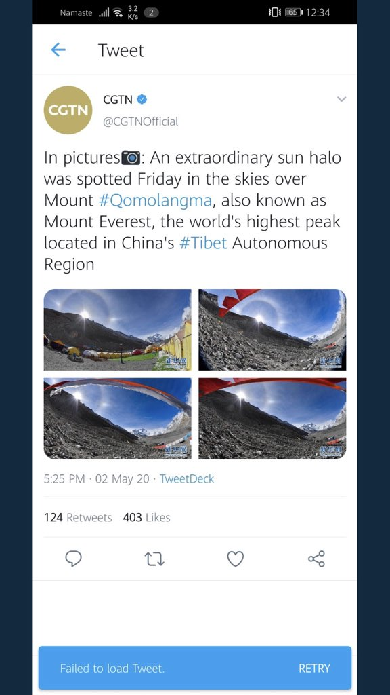
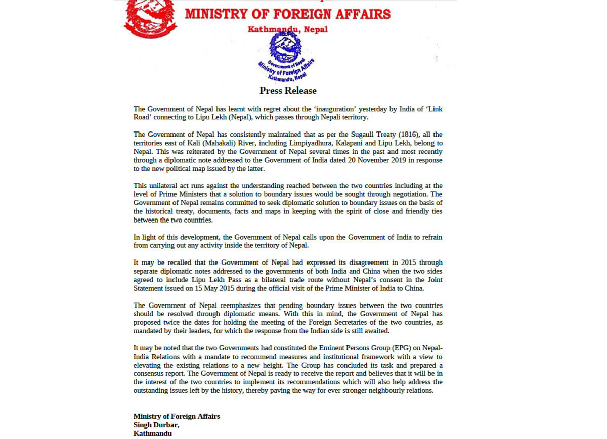
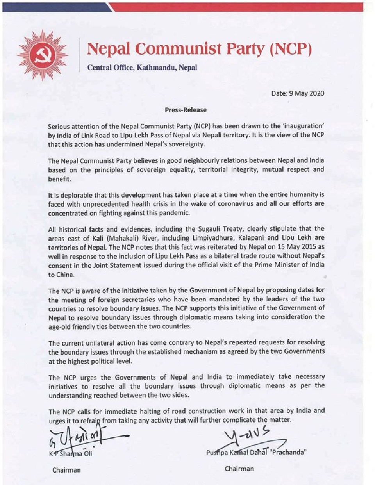

- During COVID-19 pandemic, two powerful nations(India, China) are trying to outlaw with small neighbouring nation like Nepal

- First post of [CGTN](https://twitter.com/CGTNOfficial/status/1259375981652922368)

- Corrected post of [CGTN](https://twitter.com/CGTNOfficial/status/1259375981652922368)

- Objection from Nepal (may 9, 2020)

# Timeline
- [Rajnath Singh inaugurates strategically crucial Mansarovar Yatra Link Road on Indo-China border](https://economictimes.indiatimes.com/news/defence/rajnath-singh-inaugurates-strategically-crucial-mansarovar-yatra-link-road-on-indo-china-border/videoshow/75626422.cms) - 08 MAY 2020
- [सिंहदरवार अगाडि नै चाइनिज र नेपाल प्रहरीबीच झडप Fights Chinese against Nepal Police](https://www.youtube.com/watch?v=VLemvtMuY6U) - May 08, 2020
- Nitin Gadkari lauds efforts of BRO (Border Roads Organisation) for achieving completion of road connectivity from Dharchula to Lipulekh - May 08, 2020
- Govt opposes inauguration of link road connecting Lipu Lekh - May 09, 2020
- [India rejects Nepal’s protest against new road to Lipulekh](https://www.hindustantimes.com/india-news/india-rejects-nepal-s-protest-against-new-road-to-lipulekh/story-MuYdyt9t6jbrZgxCbpMfwO.html) - May 09, 2020
- [After Lipulekh, Chinese media’s May 2 tweet on Chomolungma trends on social media](https://thehimalayantimes.com/nepal/chinese-media-claims-mt-everest-is-in-china/) - May 10, 2020
