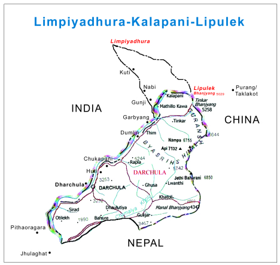
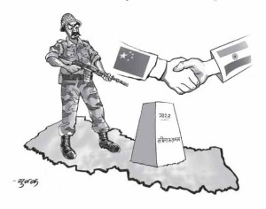

# Authenticity of Lipulekh border pass

Decision to expand Sino-Indian border trade through Lipulekh Pass disregards Nepal’s sovereign rights over the area

According to the joint statement issued on May 15 in Beijing during Indian Prime Minister Narendra Modi’s visit to China, the two countries have agreed to expand border trade through Lipu-Lekh Pass. The 28th point of the joint communiqué states that ‘the two sides agreed to hold negotiation on augmenting the list of traded commodities, and expand border trade at the Lipu-Lekh Pass.’

The main intention of the joint communiqué is to recognize and enhance border areas co-operation through border trade, pilgrimage by people of the two countries. It also agreed to effectively promote mutual trust, and broaden co-operation, so as to transform the border into a bridge of cooperation and exchange.

From Nepali perspective, there could be a question as to whether India and China needed to obtain Nepal’s consent to expand border trade at Lipu-Lekh Pass, a Far-Western point of Nepal, which Nepal claims to be a part of its territory. The Lipulekh Pass is located at the Nepal-China borderline. However, Indian para-military forces have occupied it since 1962 after the Sino-India border war. It is an ancient route for traders and pilgrims transiting between Nepal and Tibet.

As the historical maps depict Nepal-China borderline runs not only to Lipulekh Pass including Kalapani area, but also extends westward up to Limpiyadhura. The Sugauli Treaty of 1816 between Nepal and British India mentions the western boundary of Nepal as the ‘River Kalee.’

## Sino-Indian border war
If we have a look on the history of Sino-Indian border dispute, there was a brief but fierce fighting border war from October 20 to November 21, 1962. During the border war, in the Western sector, the Chinese forces marched up to the borderline shown in the Chinese maps dating back to the Manchu Dynasty. India’s option was to defend on the McMahon Line as its northern boundaryline. After the Chinese carried out an all-out counter-attacked along the entire Sino-Indian border. So Indian forces were compelled to retard back after a heavy attack of the Chinese army.

The Indian military, when pulling back, came to realize that the Lipulekh Pass could be a potential strategic point, given that it is located at located at 5,029 metres in the Nepali frontier. They established a camp at Kalapani area. The camp, which is outfitted with underground bunkers, is near about ten kilometer west of the Lipulekh pass. It is notable that there is a hillock (6,180 m) as a strategic place at Kalapani.

If someone gazes from this hillock, it could be recognized even posture and colour of men who have been travelling through Lipulekh Pass, so that the Indian army would be alert as per situation. In due course of time India deployed army battalions and constructed seven brick-built barrack houses with heating system and underground bunkers and three more administrative buildings at Kalapani. There are modern arms and ammunitions including satellite communications.

## Nepalis not allowed
Nepali nationals, even those on a pilgrimage to the Manasarobar Lake and Mount Kailash are not allowed to enter into Kalapani area and Lipulekh Pass. It is baffling that Nepalis cannot even travel through their sovereign territory.

Regarding the issue of Lipulekh-Kalapani-Limpiyadhura area, Nepal has also, in a sense, been negligent. It has not yet delineated the origination of the Mahakali River, though the treaty of Sugauli (1816) mentions, ‘Kalee is the western border of Nepal with India. Even the Joint Technical Level Nepal-India Boundary Committee, which worked for 26 years up to the end of 2007, never ventured into delineating the source of the river Kalee, because it needs a political decision.

In this context, it was not a diplomatically sound move on part of China and India to reach an agreement to expand their border trade through Lipulekh pass, during the visit of Indian Prime Minister Narendra Modi to China.

## Authenticity of Lipulek
i) The Lipulekh Pass is a part of the Nepali territory is supported by many facts. The historic maps of 1827 and 1856 and among others, published by the British Survey of India, depict that the Western boundary of Nepal is extended up to Limpiyadhura, and the river originating from this point is named as ‘River Kalee.’

ii) Similarly, the ‘Old Atlas of China’ a map published during Qing Dynasty (1903), depicts, in Chinese characters, Limpiyadhura as the source of the Kali River. The word ‘Nepal’ is scribed in the map for the north-eastern part of the river.

iii) Former Spokesperson of the External Affairs Ministry of China Zhang Kiyu has said on November 15, 2001 during the press conference in Beijing, ‘we have noted the territorial dispute over Kalapani between India and Nepal. Nepal and India are both our friendly neighbours. It is our sincere hope that the two sides will seek a fair and reasonable solution to this issue through friendly consultations and negotiations.’ (TODAY Magazine, Vol-23, No-3, Sept-Oct 2004, Page 35).

iv) The Chinese Embassy in Kathmandu, in a letter to the Nepal government, has said ‘border issue of Kalapani should be resolved through a friendly bilateral consultation between Nepal and India. The Chinese side fully understands the concerns of the Nepali side and respect the sovereignty and territorial integrity of Nepal.’ ( Kathmandu Post, May 11, 2005).

v) The then Chinese Ambassador to Nepal Zeng Xu Yong has said ‘three and half decades ago, when Nepal and China signed border agreement, Lipulekh pass was designated as the tri-junction between Nepal, India and China, according to which Kalapani area belongs to Nepal. However, during the agreement, older facts and evidences that extended the Nepali border to Limpiyadhura, the origin of the Mahakali River, were largely ignored.’ (Kantipur, September 3, 1999).

vi) Diplomat Sun Gaosung as the head of Chinese delegation to India to talk on China-India border issue has said on November 24, 1999 ‘India had proposed to hold the joint meeting at Kalapani, but we responded that it is beyond the policy of our nation to go out of the capital for the joint meeting.’

vii) On the Indian side, Indian authorities including current Prime Minister Narendra Modi and Prime Minister Sushil Koirala have jointly directed the Foreign Secretaries of the two countries to work on the outstanding boundary issues, including Kalapani and Susta, receiving required technical inputs from the Border Working Group as necessary. ( Joint Press Statement, August 5, 2014).

viii) Former Prime Minister of India I. K. Gujaral has said ‘as regards Kalapani, the technicians from both the sides are engaged in the demarcation of border. If their reports conclude that the area belongs to Nepal, we will immediately withdraw from there.’ (Gorkhapatra Daily, February 24, 1997).

ix) The then Indian External Minister Pranab Mukherjee has stressed ‘we have agreed to resolve the outstanding border disputes between the two countries at various places including Kalapani and Susta through further discussions.’ (Himalayan Times Daily, November 26, 2008).

x) Most recently, visiting General Secretary of Communist Party of India (Marxist) Sitaram Yechury has denounced the recent joint statement of India and China on opening trade route through Lipu-Lekh, which Nepal government claims to be inside its territory, and said the two countries should have consulted Nepal prior deciding on the plan. (Kathmandu Post Daily, June 11, 2015).

xi) Former Nepali Prime Minister Girija Prasad Koirala has also said, ‘we think that the territory of disputed Kalapani is ours. This dispute should be resolved on the basis of all our historical documents. If the evidences prove that the territory belongs to us, India should move out from there.’ ( Gorkhapatra Daily, June 9, 1998).

xii) Nepal-India joint press statement (March 23, 2002) during the then Nepali Prime Minister Sher Bahadur Deuba’s visit to India mentions, ‘the prime ministers also directed the joint working group of the joint technical-level boundary committee to expeditiously complete its examination of the facts relating to the alignment of the boundary in the western sector, including the Kalapani area, and in other pockets, where there were differences in perceptions of the two sides.’

## Technical tantrums

i) Some areas in the tri-junctions, where the Nepali-Indian-Chinese territory meet (on both the Western and Eastern segments), have not yet been demarcated due to India’s absence during Nepal-China border demarcation, which took place in 1961-62.

ii) Issue of Lipulekh and Kalapani were raised during the Nepal-India Boundary Working Group’s meetings. Nepal has strongly argued before the Indian side that ‘Kalapani belongs to Nepal.’ (Himalaya Times, 16 July 1998).

iii) But due to the controversy over the origination of the Kalee River, ‘strip mapping,’ which is 97 percent complete, is yet to materialise. Nepal seeks the spirit of the treaty of Sugauli and the application of the watershed principle to determine the source of the river.

iv) During the demarcation of the boundary, Nepal-India adopted joint global positioning system (GPS) survey, but could not go north beyond Garbyang and Chhangru due to lack of political decision.

## Nepal’s moment
With all these facts and figures in place, the expansion of Sino-Indian border trade activities must not take place through the Lipulekh Pass. Both India and China do not have sovereign rights over the Lipulekh-Kalapani-Limpiyadhura area. The recent China-India negotiations on augmenting the list of traded commodities and expanding the border activities through the Lipulekh Pass contradicts the Nepal-China Boundary Treaty of 1961. China also should be aware on this matter to maintain the principle of Panchasheel.

In the mean time, the Nepal government and some political party leaders have raised serious concerns over the recent understanding reached between the India and China regarding Nepal’s Lipulekh Pass. A meeting of Nepal Parliament’s International Relations and Labour Committee raised serious objection over the agreement reached between India and China to boost border trade at the Lipu-Lekh Pass, close to an area which Nepal claims to be a part of its territory.

The committee has also directed the Foreign Ministry and the government to conduct a study over the deal, and take up the matter with India and China while urging both the neighbours to correct their agreement pact immediately (Kantipur Daily, June 10, 2015).

The committee said the India-China agreement, made during Prime Minister Narendra Modi’s recent visit to China, was against international norms and values at a time when Nepal and India are working to resolve the boundary issues. This scribe had a chance to brief that committee meeting on Lipulekh issue. The meeting was conducted by the Committee Chairman Prabhu Shah, in presence of the Minister and Secretary of the Ministry of Foreign Affairs. The panel also directed the foreign ministry and the government to conduct a study over the deal, and take up the matter with India and China while urging both the neighbours to correct their agreement pact immediately (Kantipur Daily, June 10, 2015).

Given the historical facts and evidences we have, Kathmandu should take up the matter with both New Delhi and Beijing through diplomatic channels, as the territory belongs to Nepal. It must approach China and remind it of the decision taken during the demarcation of the China-Nepal border.

At the same time, it has to convince China of the historical and documented facts related to Nepal. Nepal must show its national interest on the territorial integrity and security of the nation. At this point of time, Nepal should create a situation that can lead to India and China either amending the concerned article of the joint communiqué or making an understanding in consultation with Nepal, so that Nepal can be incorporated into the Lipulekh border trade to make ‘Trilateral Special Economic Zone.’

- Buddhi Narayan Shrestha, Border Researcher/Board Member, Institute of Foreign Affairs
- Posted on June 29, 2015 by bordernepal
- https://border-nepal.com/tag/historical-maps/
