## DEMARCATION OF THE INTERNATIONAL BOUNDARIES OF NEPAL
- Buddhi Shrestha, Nepal
- https://www.fig.net/resources/publications/figpub/pub59/Figpub59_screen.pdf
- Demarcation of the International Boundaries of Nepal", in Haim Srebro (ed.), International Boundary Making

1 HISTORICAL BACKGROUND 

The Himalayan Republic of Nepal is situated between two emerging Asian giants, India
and China. The frontier of Nepal is surrounded on its south, east, and west by India, and
on the north by China. Nepal is elongated at the east-west in a rectangular shape.

The Himalayan range is a natural wall between Nepal and China. There are neither natural walls nor man-made fences along the Indo–Nepal border. The flat Indo-Ganges
flood plain extends from India towards the Nepali frontier. The less porous barrier border has challenged the identity of Nepal at the local and national level.

In 1745 Prithvi Narayan Shah the Great initiated the unification of various petty kings,
small kingdoms and principalities of the Himalayan region. He formally established Nepal as a Himalayan State on November 17, 1769. His descendants continued the unification movement; in 1806 Nepal’s border was extended from the Tista River on the east to
Kangra on the west. Similarly, Nepal was extended up to the confluence of the Gandak
and Ganges Rivers to the south, and to Shigatshe and Tashilhunpo Gomba (monastery)
across the Himalayas to the north, which falls today in the Tibetan Autonomous Region
(TAR) of China. It was called the ‘Greater Nepal’.

In ancient times Nepal’s north-western border reached nearly to the Mansarovar and
Rakchhyas (Monster) Lakes of the present TAR. According to historians, there were four
Thum areas (the then hill administrative units) on the north of the present Darchula,
Bajhang, and Humla districts of Nepal. The border in those times had nearly reached
the Kailash Mountain, and the four Thum areas, as mentioned, were Konghe, Munge,
Saker, and Laddhak. It is also said that Prime Minister (PM) Jung Bahadur handed over
the four Thums to China for Rs. 6,000.

Studies of various historical maps show that the borders of these districts had been
extended from the Gurla Mandhata range of the Purang province of Tibet to the margin
of the Laddhak mountains and to the vicinity of the Konghe lake, which is the origin
of the Bramhaputra River. But the Tishe Kailash is seen even north of Mansarovar. This
shows that Nepal’s northwestern border reached farther north than the present border.

Centuries ago, there were a few confrontations between Nepal and China, especially
regarding economic and trade affairs. In this context, there were border conflicts in a
few trade and transit points. Agreements and treaties were made from time to time to
settle such conflicts amicably. As a result, the Khasa Treaty (1775) was signed to maintain the borderline in its previous position. In the Kerung Treaty (1789) Nepal withdrew
from the invaded Tibetan land. The Treaty of Betrawoti (1792) aimed at preventing an
unprovoked dispute regarding the possession of each party’s territories, and the Treaty
of Thapathali (1856) aimed at restoring Taglakhar, Chewur Gumba, Kerong, Jhunga,
Kuti, and Dhakling to territorial ownership by Tibet and at withdrawing all the Nepalese
troops that were on Tibet’s side of the Bhairab Langur range.

After the Treaty of Thapathali, also termed the Nepal–Tibet Treaty of Peace-1856, Nepal has had no conflicts and disputes with Tibet. Since then, a mutually agreed upon
borderline has been maintained and economic, social, and cultural relations have developed smoothly. To promote relations and friendship between the two countries, the
Sino–Nepal Boundary Agreement was signed on March 21, 1960. As a result of this
agreement, a Boundary Treaty was made on October 5, 1961. The boundary line was
demarcated accordingly and the first boundary protocol was signed on January 20, 1963. This is the present northern boundary line of Nepal.

Regarding the southern boundary, when India was ruled by the East India Company,
British India did not like Greater Nepal as a unified and integrated country. Following
conflicts regarding territory between Nepal and British India, the western border of
Greater Nepal shrunk to the Sutlej River in 1809. Border disputes, claims, and counterclaims intensified, which resulted in the 1814–1816 Anglo-Gurkha War. British India initiated steps towards establishing a treaty. The Treaty of Sugauli was signed between
Nepal and British India on March 4, 1816. According to this treaty, Nepal lost one third
of its territory from Mechi to the Tista River on the east and from Mahakali to Sutlej
(Kangra) on the west.

 Nepal had to concede all the territories within the hills east of the River Mechi, including the fort and lands of Nagree and the Pass of Nagarcote, leading from Morang into
the hills, together with the territory lying between that Pass and Nagree to the Company Government. In the west, the territory west of the Mahakali River was transferred
to the Company Government, and a provision was made that the King of Nepal would
undertake a commitment not to be concerned with these countries or the inhabitants
thereof. Besides, the whole plain Tarai region (except for the Butwal area) from the Koshi River to the Kali River came under British control.

Nepal was very uncomfortable due to the compulsory signing of the Sugauli Treaty.
In order to console and appease the King of Nepal, the British prepared an agreement,
whereby they were ready to return to Nepal the Tarai plains from the Koshi River to
the Rapti River. However, the British discontinued paying the 200,000 Rupees they had
been paying to the King of Nepal to mollify the high officials of the Royal court. The
agreement was signed by the King on December 11, 1816.

In course of time, discontent and agitation against the British rule in India began in 1850. The first struggle for independence in India started with the Sepoy (Soldiers) Mutiny. British India requested Nepal’s friendly offer of help to quell the Sepoy Mutiny.
Nepal sent at first six regiments of Gurkha troops on July 2, 1857 to assist the British.
Later, PM Jung Bahadur led the Gurkha army with an additional three regiments and
suppressed the fighting, and consequently the mutiny subsided.

The British were highly impressed by the bravery and tactics of the Nepalese troops in
suppressing the rebels, especially their leader, Jung Bahadur. As a reward, the British
decided to return the territory called Naya Muluk of the plain areas from the Kali River 

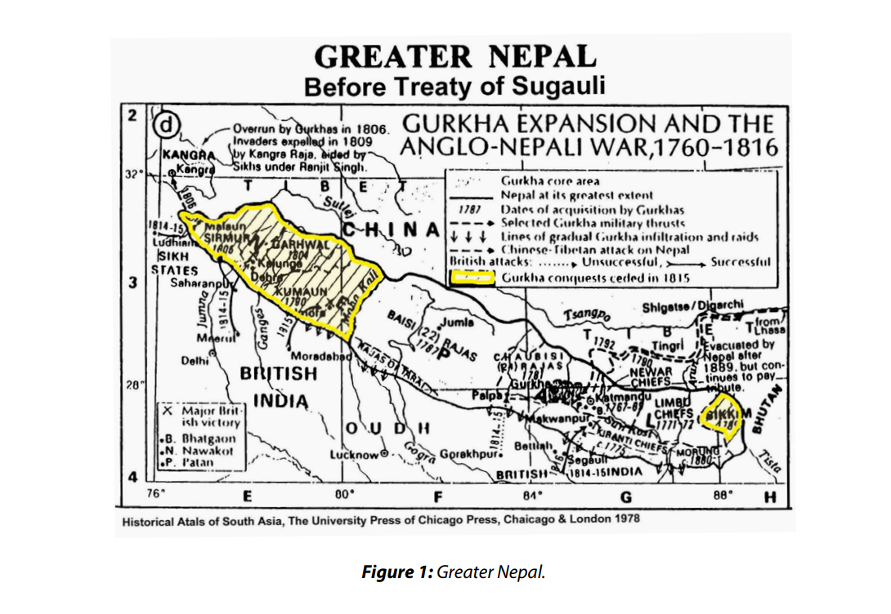

to the Rapti River, which was taken away from Nepal by the stipulations of the Sugauli
Treaty. This return of territory was formalized through a border agreement signed on
November 15, 1860.

In time, and owing to past developments, the borderline of Nepal has been constricted
to the present territory of Nepal – the Mechi River on the east, the Mahakali River on
the west, the watershed of the Himalayan Range on the north, and to the plains of the
Tarai on the south.

2 BOUNDARY DELIMITATION 
> Nepal is surrounded by its neighboring countries: China and India.

> 2 Bhasin, Avtar Singh, (1994) Nepal’s relations with India and China, Siba Exim India.

> 3 Aitchison, C.U. (1929), A Collection of Treaties Vol. VIV, Calcutta, p 65.

> Ministry of Foreign Affairs (A letter from Prime Minister Jung Bahadur Rana to Lt. Col. George Ramsey on Thursday, September 21,1860).

>5 Ministry of Foreign Affairs (A letter from the Prime Minister Jung Bahadur Rana to Lt. Col. Richard Charles Lawrence on
April 5, 1865).
> Nepali, Chitta Ranjan (1964), Nepal–China Boundary Treaty, Kathmandu, p. 31.
> 7 Nepali, Chitta Ranjan (1964), Nepal–China Boundary Treaty, Kathmandu, p. 69.
> 8 Notes exchanged on agreed points on the Sino–Nepalese boundary, Kathmandu, August 14, 1962.

2.1 The Nepal–China Boundary Delimitation

The allocation of the boundary between Nepal and China was agreed upon at the political level. The borderline was drawn along the Himalayan Range, between the Chinese
territory in the north and the Nepalese frontier in the south. The allocation states that
the borderline runs west to east along the Himalayan Range, including peaks, summits,
crests, mountain passes, narrow river valleys, pasturelands, and along the slopes. The
main Himalayan range, which is perennially covered with snow, and the other smaller
ranges and sub-ranges between the Zanskar range, in the west and the Janak subranges along the east, contain eight of the highest peaks, with heights of over 8,000
meters, including Mt. Everest (Sagarmatha), and 34 main mountain passes.

PM Bisheswor Prasad Koirala of Nepal and Chou En-Lai of China signed the Sino–Nepal Boundary Agreement on March 21, 1960 to scientifically demarcate the traditional
border between the two countries and to resolve, once and for all, minor differences of
opinion about the borderline. The agreement contains six articles. It includes a provision whereby the traditional border recognized by both countries will be accepted and
that a Nepal–China joint border committee will be established for demarcation with
equal representation from both sides. The committee was assigned the job of solving
border issues through mutual talks and understanding. It could carry out border surveys, erect border pillars, and draft the border treaty.

The 1960 agreement made a provision whereby three techniques would be adopted
to deal with three different types of cases while the border was demarcated. Having
studied the delineation of the boundary line between the two countries, the contracting parties decided to determine the boundary in the following ways in accordance
with three cases:
1. In sections where the delineation of the boundary line on the maps of the two
sides is identical, the boundary line will be fixed according to the identical delineation on the maps. The parties will conduct a survey on the spot and erect
boundary markers.
2. In sections where the delineation of the boundary line on the maps is not identical, whereas the state of the actual jurisdiction by each side is undisputed, the
joint committee will authorize joint survey teams to conduct surveys on the
spot, determine the boundary line, and erect boundary markers in accordance
with concrete terrain features (watershed, valleys, passes, etc.) and the actual
jurisdiction (possession or user’s rights).
3. In sections where the delineation of the boundary line on the maps is not identical and the two sides differ in their understanding of the state of the actual jurisdiction, the joint team will immediately ascertain the state of the actual jurisdiction, make adjustments in accordance with the principles of equality, mutual
benefits, friendship, and mutual accommodations to determine the boundary
line and erect boundary markers in these sections.

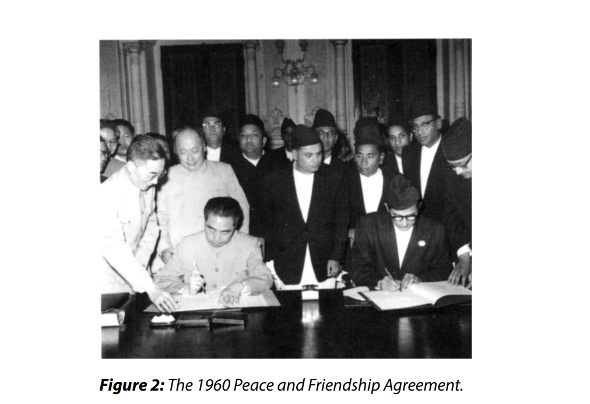

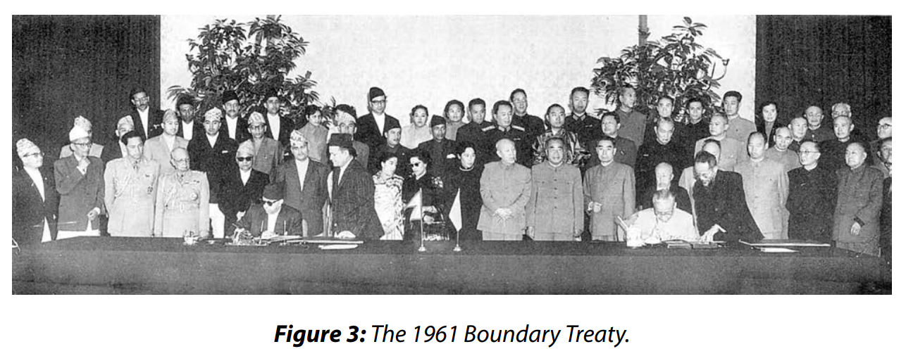

To make the provision of the agreement a reality, a Nepal–China joint border committee was formed on March 21, 1960 in an agreement to draft the treaty. The Nepali delegation was chaired by Major General Padam Bahadur Khatri and included seven members. The Chinese delegation, chaired by the Ambassador of China to Nepal Changshi
China, included seven members.

Two advisors from each side were nominated to provide the necessary counseling to
the joint committees. The first meeting of the committee was held from the 12th of
August to the 26th of October 1960 in Kathmandu with six rounds of talks. Follow-up
meetings were held in Beijing (the 18th of January to the 15th of February,) and in Kathmandu (July 31 to August 24, 1961). The committees then delineated the border and
formulated the draft of the treaty cordially.

The boundary treaty, prepared by the Nepal–China Joint Boundary Committee, was
signed by His Majesty King Mahendra Bir Bikram Shah Dev of Nepal and by Chairman
Liu Shao-Chi of China on behalf of their respective governments on October 5, 1961.
The treaty adopted the traditional border as the basis on which the joint committee
should demarcate the borderline from west to east under the principle of equality for 
mutual benefit and friendship, and the parties agreed to make on-the-spot decisions
by mutual coordination.

It was agreed that the formal settlement of the boundary between China and Nepal
is of fundamental interest to the peoples of the two countries. It was believed that
a formal delimitation of the entire boundary and its consolidation as a boundary of
peace and friendship not only constitutes a milestone in the further development of
the friendly relations between Nepal and China—it also contributes towards strengthening peace in Asia and the world.

Nepal has had border issues with both India and China. Regarding China, these issues
were settled and resolved upon the signing of the Boundary Treaty of October 5, 1961
and by the delineation and the physical demarcation of the boundary line. However,
there were disputes, conflicts, controversies, debates, claims, and counter-claims in 32
places along the boundary, including Mt. Everest, during the joint boundary demarcation on the Sino–Nepal borderline.

It is commendable that all the disputes, claims, and counter-claims were settled forever
in accordance with the principles of equality, mutual benefits, friendship, mutual understanding, and accommodation. Both parties adopted the Five Principles of Peaceful Co-existence and in a spirit of fairness, reasonableness, mutual understanding, and
most importantly, respecting each other as having equal rights. All the issues, except
Mt. Everest, were settled by the Joint Boundary Committee. Regarding the question of
Everest, during the visit of PM Chou En-Lai to Kathmandu on April 28, 1960, he stated
that “Mount Everest belongs to Nepal.

2.2 The Nepal–India Boundary Delimitation

Prithvi Narayan Shah the Great started to unify 56 small kingdoms and principalities
into the strong Himalayan State of Nepal in 1769. His successors completed the unification campaign and the territory of Nepal was extended from Tista to Kangra as Greater
Nepal by 1806. In those days, the British, who had entered India with the intention of
doing business there, ruled India. They began to turn their eyes towards Nepal. The East
India Company Government was looking for an opportunity to expand trade to Tibet.
But since the border of the then Nepali Kingdom had extended west to east, covering
the northern frontier of British India, the Indian businessmen did not have direct access
to Tibet. All the easy access transit points to enter into Tibet from India were under the
territory of Nepal. The British did not see alternative ways to fulfill their wish to trade
with Tibet through Nepal, except by using military force. They raised the issue of the
boundary of Seuraj and Butawal of Nepal as a pretext for them to go on war.

The British sent a letter to Nepal in March 1814, giving it an ultimatum, to be replied to
within 25 days, namely, to abandon its occupation of the territory of Seuraj and Butawal. Nepal did not respond. Therefore, Lord Hastings officially declared war against
Nepal on November 1, 1814. Then, a dreadful war between the Nepalese and British
army took place. Many fighters from both sides lost their lives during the war, which
continued until May 16, 1815. In the meantime, the British proposed a peace treaty and
Nepal was also ready to negotiate terms for achieving peace. Finally, a treaty of peace
and friendship was drafted and sent to Nepal by the East India Company on December
2, 1815. Nepal counter signed the treaty on March 4, 1816 at Sugauli, officially ending
the war.

 In the ensuing days, this treaty became known as the ‘Treaty of Sugauli 1816.’ The major conditions stipulated by this nine-article treaty included the following: ‘the King of
Nepal shall give up the claim on all the territories that had become a matter of dispute
before that war, he shall accept the authority of the Company Government over the
Tarai (plain area) across the River Tista in the east; to Satlaj and Kangra in the west.’ This
treaty largely shrank the border of Nepal from the Mechi River to the Mahakali River. As
a result, one third of the Nepalese territory was chipped off.

In fact, this treaty was in favor of the East India Company and Nepal lost a lot of territory. Nepal was highly dissatisfied to lose a large chunk of land from Mechi to Tista,
where there was no war. Therefore, to pacify Nepal and as an indemnity, a Supplementary Boundary Treaty was signed in December 11, 1816, which resulted in Nepal being
restored the lowlands (Tarai) from the Koshi River to the Rapti River. In the course of
time, as a reward to Nepal, which had survived the Sepoy Mutiny in India, British India
returned the ceded lowland of Nepal from Rapti to Mahakali as new territory (Naya
Muluk) by signing the Boundary Treaty of November 15, 1860.

Importantly, the Treaty of Sugauli (March 4, 1816) and the Supplementary Treaty (December 11, 1816) are the bases for the delineation and demarcation of the eastern, the
western, and a portion of the southern borders of Nepal, even though the Boundary
Treaty (November 15, 1860) specifically implied the southwestern portion, as the restoration of the Banke, Bardiya, Kailali, and Kanchanpur districts as new territory (Naya
Muluk). This became the boundary of present-day Nepal.

3 DESCRIPTION OF THE BOUNDARY LINE

Nepal is bordered to the north by China and to the south, east, and west by India. Nepal
shares a 1,880 km border with India, as an open border regime. Nepal shares a 1439.18
km borderline with China. There is a regulated border management between Nepal
and China. 

3.1 Description of the Nepal–China Boundary Line

The boundary treaty of October 5, 1961 resulted in dividing the Nepal–China borderline into 13 sectors. The Chinese-Nepalese boundary line starts from the point where
the watershed between the Kali River and the Tinkar River meets the watershed between the tributaries of the Karnali River, on the one hand, and the Tinkar River on the
other hand. Hence, it runs south-eastwards along the watershed between the tributaries of the Karnali River and the Tinkar River and the Seti River, passing through the
Lipudhura snowy mountain ridge and Tinkarlipu (Lipudhura) Pass to Urai Pass – Nala
Kankar Himal (6,550 m) – Kali Gandaki (6,241 m) – Chaklo-Gyala pass – Thaple Bhanjyang (pass) – Yangra Himchuli – Chusumdo – Chomo Parmari – Nechle Sanghu (bridge)
– Popti Bhanjyang – Rakha pass – Kangla pass and Chabuk pass to the terminal point
where the watershed between the Khar River and the Chabuk River meets the watershed between the Khaar River and the Lhonak River.

Maps on a scale of 1:500,000 were prepared showing the entire boundary line, and
were attached to the treaty. Other maps, on a scale of 1:50,000, were prepared to show
the location of temporary boundary markers to be erected by both sides and the detailed alignments of certain sections of the boundary.

The agreement of March 21, 1960 states that the boundary between the two countries
will be set up by permanent boundary markers as necessary along the boundary line,
and then a protocol will be drafted, setting forth in detail the alignment of the entire boundary line and the location of the permanent boundary markers with detailed
maps. Upon signing the boundary protocol, the tasks of the Chinese-Nepalese Joint
Boundary Committee were terminated and the question of the boundary between the
two countries ceased to be in force.

It was also agreed that any dispute concerning the boundary, which may arise after the
formal delimitation of the boundary, will be settled by the two parties through friendly
consultations.

3.2 Description of the Nepal–India Boundary Line

Whereas the northern borderline of Nepal along the boundary with China follows the
watershed of the Himalayan Range, passing through high peaks, mountains, gorges,
and pasturelands, the southern borderline of Nepal with India runs through fertile
plains, jungles, and rivers. On the east, the Mechi River and the watershed of the Singhalila Range with hills and hillocks represent the border. On the west, the borderline
between Nepal and India runs along the Mahakali River.

According to the Treaty of Sugauli, the Kali River defines the whole western boundary
of Nepal with India. Kali as the boundary river is delimitated by Article 5 of the treaty.
It states “the Rajas of Nepal renounces for himself, his heirs, and successors, all claim to or
connection with the countries lying to the west of the River Kali and engages never to have
any concern with those countries or the inhabitants thereof.” Thus, the place where the
Kali River originated is the northwestern corner border limit of Nepal with India that
forms a tri-point with China.

Regarding the eastern border, the line was delimited by the course of the Mechi River,
as mentioned in article 3 (5) of the Sugauli Treaty. It includes the fort and lands of Nagree and the Pass of Nagarcote leading from Morung into the hills, together with the
territory lying between that Pass and Nagree. The uppermost eastern boundary, north
of the origin of the Mechi River, is delimited to the watershed ridge of the Singhalila
Range up to the Jhinsan peak, forming the Nepal–India–China tri-point.

The southern boundary of Nepal starts east of the low lands of the older river course
of the Kali River (Mahakali/Sharada) at Khatima of India and Kichka Sundarnagar of
Nepal. The borderline goes eastward from this point to Belauri and further ahead, and
then it turns to the north until it reaches the Mohana River of the Indian District of
Gorakhpore, which was in Nepal territory until 1815. Then, the borderline follows the
Mohana River to the confluence with the Karnali River. It then goes east and turns south
to Bhada Nala and then a little bit north to the Babai River. From Babai, the delimitation
line goes east and turns south to meet Man Nala.

From Man Nala, the boundary extends east to the Rapti River. Following the Rapti River
a little bit, the delineation line goes to the foothills north of Baghaura Tal, which join the
eastern border of Rohil Khanda, following the boundary between the British Province
of Oudha and the territories of the then Maharaja of Nepal. Thereafter, it follows the
southern foothills of the Dhundwa Range. Then, it reaches the confluence of Arrah Nala
(Nudee) via Koilabas

Following Arrah Nala a little, the line runs eastward to the Kothi River and then turns
south to the Ghongi River. From Ghongi, the border takes a turn northward to the Tinau
River. In this sector, the boundary line goes through an area where there were inconsistencies regarding the border and disputes along Oudh, Rohilkhanda, and Gorakhpur,
before and during the 1814–1816 Anglo-Gurkha war. Then, the line proceeds straight,
east to the Gandak River (Narayani). Thereafter, the boundary line follows northward
along the river course of Gandak to Tribeni Ghat. Then, the line goes eastwards to the
Panchanad River. From Panchanad, it follows the Someswor Range until it reaches
Thori. Then, the borderline turns to the Uriya River.

From Uriya, the border goes eastward to the Bagmati River and the Lakhandehi River;
later it extends farther east to the Hardi River. From Hardi, it turns south and east and
then turns north and again east to the Kamala River. The boundary line advances farther east to the old course of the Koshi River. Next, the borderline tracks north-east and
then turns to a little south and again it runs east to the Ratuwa River. From Ratuwa, the
border extends farther east and then somewhat north and then again east, and ultimately the borderline meets the Mechi River near Sukhani Lodabari of Nepal and Kado
Gaun of India, as the end of the southern borderline.

4 THE PROCESS OF NEGOTIATIONS

Nepal and China negotiated the adoption of the following principles and guidelines for
the delineation of the boundary between the two countries:
1. Follow the watershed.
2. Include the mountain peaks, passes, ravines, gorges, and river valleys.
3. Follow the river’s course and its confluence.
4. Adjust territory on the basis of give and take.
5. Honor actual jurisdiction (user rights and possession).
6. Choose citizenship, in case of cross-holding occupations.

Regarding Nepal’s present border with India, it is said that in general it is delineated
and demarcated by the Sugauli Treaty and its subsequent treaties.

After the Sugauli Treaty, there were disputes and differences at various places. According to the agreement of December 11, 1816, such disputes should be settled with mutual understanding, on the basis of exchanges of equal portions of land, as mutually
considered desirable for the new boundary. It further states that in case it is impossible
to establish desirable limits between the two States without a survey, it will be expedient that Commissioners be appointed on both sides, for the purpose of arranging in
concert a well-defined boundary on the basis of the preceding terms, and for establishing a straight line of frontier, with the aim of distinctly separating the respective
territories of the British Government to the south and of Nepal to the north. In case
any indentations occur that will destroy the even tenor of the line, the Commissioners
should arrange an exchange of lands guaranteeing interference on principles of clear
reciprocity.3

The above-mentioned examples illustrate that there were disputes on the border just
after the Treaty of Sugauli, which showed Nepal’s disenchantment regarding the treaty.
Disputes in several areas were settled, but in many other places the disputes remain to
be settled and there are still debates, conflicts, and controversies.

The 1869 land dispute at Bhagaura Tal (Lake) and Arrahnala was negotiated and settled
in 1874, after Jung Bahadur returned from Calcutta, upon signings by Captain Samuel
and Subba Padmanabha Joshi. There was also the provision that if the Nepalese and
British commissioners disagree on the settlement of the border, a third official would
look into the dispute and he would settle the dispute with mutual confidence from
both sides. One example of that was when Lt. Col. McAndrew and Captain Siddhi Man
Singh Rajbhandari had a difference of opinion and the case was settled by Sir Dite Forseyth, who was appointed as the third official. This was agreed upon by both parties and
an agreement was signed by Mc Andrew and Siddhi Man Singh.

There are other examples as well. A letter written by Jung Bahadur to Lt. Col. George
Ramsey also reveals that there were border disputes at various places. The letter reads:
*“In order to avoid any future conflict, I want to draw the boundary line with the statement
mentioning about the border pillars at several places of the big villages and settlements
of both sides. The British commissioners had erected permanent concrete pillars in various
distances. They had also constructed earthen pillars at various points of the settlement in
between permanent concrete pillars but they were weak earthen pillars at every 130 steps
(foot) both of which are not strong enough. I hope they will be made strong and permanent
so that they will last longer. There are 210 concrete but small pillars from the northern hills
of Baghaura Tal, which meet with the eastern border of Rohil Khanda.”*

Similarly, the letters exchanged between Jung Bahadur and Lt. Col. Richard Charles
Lawrence also refer to border disputes. The letter reads: *“It was taken that the border
points on the area near Sharada River, which was received from the British, had been demarcated in the map by the British and the Nepali representatives. But the lines demarcated
by the British are put in red and that by the Nepalese in green ink border line. The green signs
signify the Nepalese limit of the frontier had reached from Ghusarighat to Brahmadev. The
border demarcation and the markings of the land, received from British to Nepal government have been done according to the report of the British commissioner commissioned in
1860 for the same purpose. The border line drawn on the map as mentioned in that report
was accepted and approved by the British government."*

5 BOUNDARY DEMARCATION

The demarcation work between Nepal and China was completed. Regarding the
boundary demarcation with between Nepal and India, three percent of the boundary
remain to be completed.

5.1 The Nepal–China Boundary Demarcation
There were more than six joint meetings, between August 12, 1960 and February 15, 1961,
for preparing an outline to form joint field survey teams, before the boundary treaty was
formally signed. In the joint committee meeting of January 28, 1961, it was decided to
deploy five joint survey teams to conduct a survey, especially in disputed areas.

It was agreed that wherever the boundary follows a river, the midstream line will be
the boundary line. In case a boundary river changes its course, the original line of the
boundary will remain unchanged in the absence of other agreements between the two
parties. Both sides also agreed that if the border river looked like it was changing its
course, both sides would work to prevent it, and neither side would deliberately divert
the direction of the river.

The demarcation on the ground was made according to the delimitation of the treaty.
Joint Survey Teams were formed to carry out the border survey, and they began erecting permanent pillars and markers on June 21, 1962 at different points of the borderline. The west to east elongated borderline was divided into 13 sectors for the purpose
of the demarcation, and six joint border survey teams were assigned as follows:6
 (1) the Nara Pass segment; 
 (2) the Mustang segment; 
 (3) the Larke segment; 
 (4) the Rasuwa segment; 
 (5) the Kodari segment; and 
 (6) the Kimathanka segment.

Under the treaty, the border areas were adjusted for either country according to its traditional uses, possessions, and its convenience, for example, the borderline after the Arun
Valley followed the southern watershed of the Arun River instead of the Naktang and
Chusar Valleys. This shifted the borderline southwards, to a distance of 2 to 3 kilometers
for 16 kilometers, in favor of China. Similarly, at several places, lands belonging to China,
which had been traditionally used by the Nepalese, were included inside Nepalese territory. These adjustments were made on the basis of ‘give and take’. Thus, 302.75 square
kilometers of Chinese territory was transferred to Nepal following this principle.7

With regard to the demarcation of a boundary following a watershed, there were some
problems of cross-holding occupation. For example, when possession of some land
and pasture land owned by the citizen of one country extended to the other side of the
border, it would belong to citizens of the other country. To resolve this problem, there
was an understanding regarding the choice of nationality. As mentioned in the Notes
exchanged on the Sino–Nepalese boundary (August 14, 1962 in Kathmandu), any inhabitant of these areas who does not wish to become a citizen of the country to which
the area belongs, may retain his previous nationality by making a declaration within
one year of the date that the agreement came into force. Persons who make such declarations may either stay where they are as foreign residents or may at any time move
into the territory of their country of nationality.

On the other hand, any inhabitant of these areas who wishes to become a citizen of
the country to which the land belongs, has to move from his present frontier and accept the citizenship of the acquired country. He was not permitted to retain his immovable property as it is, in his previous country. Therefore, he should have sold his land in
cash within a period of one year. Otherwise, the government would take his land and
compensation would be provided to him at a rate fixed by the local authorities of both
frontiers.9

The survey teams replicated the details mentioned in the boundary treaty in the actual demarcation, and jointly ascertained the position of the permanent border points.
Thus, the borderline between Nepal and China was fixed clearly and formally. The joint
teams carried out their assigned task of undertaking the survey work and erected border pillars and markers within about a year.
The joint boundary survey teams erected two types of reinforced concrete cement
(RCC) pillars. The larger size pillar has a length of 150 cm, of which 80 cm is underground. The smaller size pillar is 80 cm, of which 30 cm is above the surface of the
ground. A third category was a marker on hard rock. A center point was marked with
the drawing of a square line.

The joint teams demarcated and established pillars and markers, specified by serial
number 1 to 79 from west to east. Of these, there were 48 larger and 31 smaller size
pillars. In addition, they established 20 offset pillars, in locations near the possible disappearance of the main pillars due to natural circumstances. The total number of constructed pillars and markers was 99. The erected main pillars/markers’ details are as
follows:

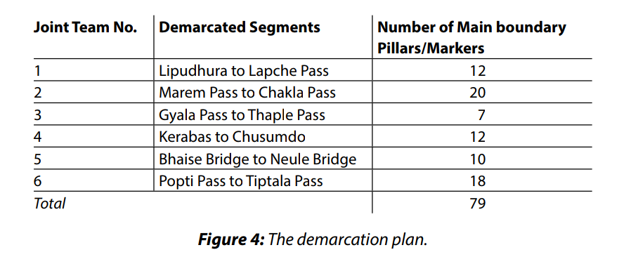

The demarcation of the Nepal–China border began by establishing the 1st boundary pillar
at Tinkar pass (where the watershed between the Kali River and the Tinkar River meets
the watershed between the tributaries of the Karnali, on the one hand, and the Tinkar,
on the other hand). The 79th boundary pillar was established at Chabuk pass (where the
watershed between the Khar River and the Chabuk River meets the watershed between
the Khar and the Lhonak Rivers), 14 kilometers west of the Jhinsang peak lying at the
tri-point of Nepal–China–India.10 Similarly, the western tri-point may be located a few kilometers west of pillar number 1, erected at Tinkar Pass. Since no triple-point pillars were
constructed at the Nepal–China–India tri-junctions, the border demarcation is incomplete on both ends of the borderline. This could not be accomplished due to the absence
of an Indian representative at the relevant time. Such common tri-point pillars must be
constructed in the presence of representatives of the relevant three countries.

The total length of the demarcated borderline was 1,439.18 kilometers. The position
and condition of the constructed boundary pillars were clearly indicated on detailed
maps. The maps are included in the border treaty, so that the maintenance and reconstruction of broken, damaged, or missing pillars could be done at their actual
locations.

The border treaty that was signed between Nepal and China was signed in accordance with the wishes of the leaders of the two states. The construction of the boundary
pillars was completed within a period of one year without any discrepancy, and the
Nepal–China boundary protocol was signed on January 20, 1963. With this signing, the
border that had remained undefined for thousands of years was formally demarcated
by a scientific method. 

5.2 The Nepal–India Boundary Demarcation

It was realized and agreed that the border demarcation between Nepal and India would
be impossible to achieve without carrying out a survey. Thus, commissioners from both
sides were appointed for the demarcation, according to the pre-conditions, to establish well-defined borderlines. In addition, there were also provisions for exchanging
portions that jot in and out of the straight line based on the principle of clarity and
mutuality. The commissioners agreed that if the land of any individual extended across
the boundaryline, the issue would be put before the governments of the two countries to solve the dispute. The Commissioners were also given the authority to make
agreements and to arrange exchanges of such lands, to allow the landowners to remain within their previous territory. It was also agreed to carry out a survey to establish
border markers, and to exchange documents bearing the borderlines, for approval by
both governments.

With this mandate, the border demarcation work between Nepal and India started with
the spirit of the Treaty of Sugauli (ratified on March 4, 1816). Surveying, demarcating
the border, and constructing pillars started just after the monsoon season of 1816. The
borderline was divided into nine segments, starting from point A to J. Point A was located at Phalelung of the Panchthar district, whereas the last station J was established
at Brahmadev Mandi of the Kanchanpur district.

The boundary line between the two countries was surveyed and demarcated in the
years 1816 to 1860; 1882; 1885; 1906; 1940–41; the line was divided into nine different
sectors with 913 boundary pillars, erected from Phalelung to Brahmadeo Mandi. The
demarcation work started from east to west.

In the first stretch, 26 pillars from Phalelung to Antu Hill and an additional 120 pillars
from the origin of the Mechi River to Bhadrapur were constructed. Then, it continued
westward from Bhadrapur to the Koshi, Lakhandehi, Uriya, and Narayani Rivers along
the second to the fifth sectors, and 101, 113, 73, and 61 pillars were erected, respectively. It was further extended to Arrah Nala, Tal Baghaura, and the Sharda River and
ultimately to Brahmadeo Mandi as the ninth and last stretch erecting 72, 95, 211, and
41 pillars, respectively, along the boundary line. 

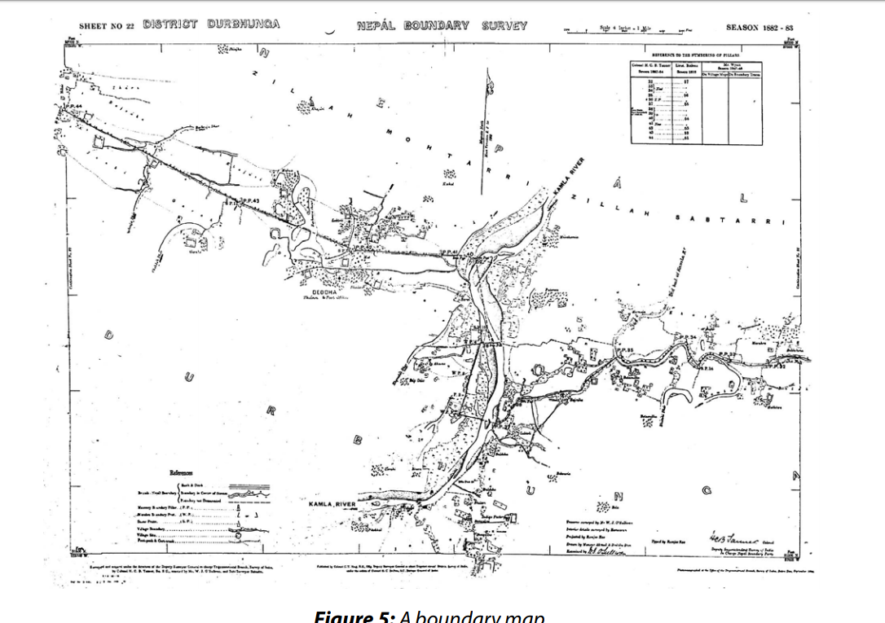

The survey and demarcation work was not completed during the British regime in India.11 The areas north of Brahmadeo Mandi along the Kali River in the western segment and north of Phalelung along the Singhalila in the eastern segment had not been
surveyed and demarcated. The uppermost area of the Kali River north of Brahmadeo
Mandi, characterized by a deep river basin in the mountains, remains to be demarcated. Where the river emerges from the gorge to the plain area near Brahmadeo Mandi
(Boundary Pillar1), it has branches and sub-branches southward on the fan-shaped
flood plain.

Description of a Masonry (Junge) Pillar

Masonry boundary pillars were erected during the demarcation. PM Jung Bahadur
Rana (1846–1877) maintained all the main Nepal–India boundary pillars so that they
would retain the same shape and size. He also maintained and painted with lime water
those pillars that were constructed before his regime. The masonry pillar was named
Junge Pillar after him. Since then, the Nepalese people used to call these pillars Junge
pillars, and Junge became synonymous to a masonry boundary pillar.

Junge pillars, with their fixed shape and size, are considered the main boundary monuments. Their height is 2.2 m and their diameter is 3 m. Their foundation is 1 m deep
under a rectangular platform 2 m by 1 m. The pillar is constructed with bricks, mortar
of brick-powder, as well as limestone and glued materials. It is a pre-cast monument
homogenously round in shape with a top round and smooth slope. A ditch, 2.5 m deep 

> 11 A letter from the British Embassy, Kathmandu to the HMG Ministry of Foreign Affairs, July 2, 1980 with an attached note.

and 1.5 m wide, is dug around the pillar for protection. It is painted with lime water so
that it can be seen from far.

After the Sugauli Treaty, Nepal and the Company Government had disputes regarding
several places over the demarcation of the border. For example, in 1840, Nepal claimed
the ownership of several settlements including the lands at Ramnagar. This dispute was
settled by a mutual understanding in a friendly manner, after the Company Government had gathered 95 witnesses, including the village chief, priests, and other Nepalese personalities.

Nepal and Sikkim had disputes over the ownership of Antu hill. There are two river origins from the two sides of Antu hill. Sikkim claimed that the northwest origin was the
source of the Mechi River, and thus Antu hill should belong to them. Nepal stated that
the river originating on the northeast is the source of the Mechi River and thus Antu hill
should belong to Nepal.

The King of Sikkim asked the British to mediate. The British assigned two British officials, J.W. Grant and Captain J.S. Lloyd, to arbitrate. They decided in 1827 that Antu hill
belongs to Sikkim. The government of Nepal appealed to the government of Bengal
against the decision. Dr. Campbell was appointed to investigate the claims. Sikkim argued that the Antu area had belonged to them long before the Gorkhali’s attack, and
that the Gorkhali had captured it in a war. Nepal asserted that since Antu hill lies west
of the Mechi River, it falls within its territory. In this context, the question arose as to
which of the two sources was the origin of the Mechi River. The British theorized that
the river, which is longer, wider, and deeper, and its water volume discharge is bigger,
should be considered as the main river, and the other as its tributary. Under this provision, the river flowing from northeast was longer, wider, and had more discharge; thus
was called the Mechi River. Campbell concluded in 1838 that Antu hill, lying west of the
Mechi River, belongs to Nepal. Thereafter, the other river flowing northwest of Antu hill
was called the Siddhi River.12

Disputes and Conflicts between Nepal and India in the Present Era

The distance between the boundary pillars during the demarcation from 1816 to 1906
was 1–2.5 km. Portions of the line are sharply bent in between boundary pillars, thus
creating ambiguity regarding the exact boundary location. A No-man’s land having a
ten-yard width (Das Gaja) on both the sides was not maintained in these areas. Later,
these were causes of disputes in a few spots.

In addition, in the course of time, portions of the dense forest (Charkoshe Jhadi) along
the Tarai border strip were cut off and cleared to provide settlements for the hill people.
Some border rivers changed their courses during the monsoon floods and eroded the
boundary pillars. Owing to population pressure in Indian settlements, especially in the
Bihar State, the Indian inhabitants encroached the Nepali frontier in order to sustain
their livelihood; later they migrated into Nepali territory.

In due time, the government of Nepal was aware of of the Indian encroachment and
occupation. The government formed an inspection team. They inspected the location of border pillars and the No-man’s land during the dry seasons of 1965 to 1967.
Finally, they submitted a report to the government. Hundreds of boundary pillars
were missing and others were destroyed or damaged. Many spots on No-man’s land
were cultivated.

Nepal communicated with India for almost a decade to formulate a common joint
inspection mechanism regarding the boundary. On February 25, 1981 the two sides
agreed to work jointly to clear and maintain the borderline, and formed the ‘Nepal–India Joint Technical Level Boundary Committee’ (NIJTLBC). The first joint meeting was
held in New Delhi, India from November 15–17, 1981. The terms of reference (TOR) of
this joint committee were as follows:
1. To resolve deputes using joint survey teams for field surveys and mapping.
2. To fix working procedures and to determine basic working materials for the
field teams, which are agreeable to both countries.
3. If there are no old maps, materials, papers, documents and data available, the
boundary will be demarcated traditionally as agreed upon by both sides.
4. To make joint field inspections and provide joint directives.
5. To revise specifications, norms, and standards for surveys and strip mapping.
6. To evaluate the progress of the field teams.
7. To determine the target and working sectors for the field teams.
8. To form joint Working Groups as and when necessary under the joint committee.
9. To form district level joint committees.
10. To hold joint meetings two times a year in Nepal and India, taking turns.
11. To submit work progress to the respective governments.

At the same time, to realize the TOR, it was agreed that five to seven joint survey and
mapping teams would be sent to the border field areas. The following TOR for the field
teams was defined:
1. Repair and maintain the broken and dismantled boundary pillars.
2. Establish the missing pillars on the basis of co-ordinates and old documents.
3. Re-erect pillars, which are washed away by a river at their positions.
4. Establish and erect subsidiary pillars in between major pillars, which were previously established at a long distance.
5. Construct reference pillars of old main boundary pillars, as necessary.
6. Demarcate the boundary line in the sectors where delineation was not made
during the British India period.
7. Establish coordinates of the pillars and markers using the Global Positioning
System (GPS).
8. Prepare strip-maps, half a kilometer on each side of the borderline.
9. Remove illegal occupation and construction, if they exist, on the No-man’s land
(Das Gaja area).
10. Keep clear records of the No-man’s land area, on each side of the border.

The NIJTBC was formed to resolve and settle the outstanding border problems and issues
between two countries. The committee was composed of eleven to thirteen member
delegates from the Ministries of Foreign Affairs, Home Affairs, Defense, National Planning
Commission, Law & Justice and Survey Department, led by the Director General of Survey
of Nepal and the Surveyor General of India. The committee worked together for 26 years.

Minor issues were resolved, a few pillars were erected, and strip-maps were prepared
but the joint committee could not settle major issues of dispute and encroachment. In
December 2007 the Survey of Nepal mentioned that there are unsolved issues in more
than 54 places.

On May 31, 2001, during the demarcation, the government of Nepal decided to adopt
a policy, which was reciprocated by India, as follows:13
1. The demarcation in the mountainous area will follow the maps and records. If
there is no document, the watershed principle will be followed.
2. The demarcation in other areas will follow the boundary line as shown on the
basic map and supporting documents.
3. If there are boundary pillars, a straight line from one pillar to the other will be the
boundary line.
4. If there is no straight line of the border, additional pillars will be erected on the
curved lines to make the line straight between boundary pillars.
scrnli_5_12_2020_2-33-25 PM.png

> 12 Singh, Amar K.J. (1988) Himalayan Triangle, The British Library, London, p. 183.

> 13 Survey Department Briefing Paper (December 27, 2007) to the Constitution Assembly IRHR, Kathmandu.

The Nepal government cabinet also decided on December 8, 1988 that:

1. A Fixed Boundary Principle will be adopted for demarcating the Tarai low land
area, on the basis of the boundary line shown on the maps agreed upon by both
sides, which were prepared after the Treaty of Sugauli.
2. In the case of mountainous rivers, the median line of the high banks will be taken as the border between two countries.

The joint demarcation work started in 1981. From 1992, after achieving considerable demarcation progress, strip-maps were scientifically prepared, using GIS, GPS, and digital
mapping technologies. To date, 182 strip-maps on a scale of 1:15,000 have been prepared
and a borderline has been drawn on the map. It is thought that it covers 97 percent of the
total length of the border, except the disputed Susta area and the encroached Kalapani
area.14 However, there are disputes and conflicts regarding the cross-holding occupation
in some other spots. The JTC could not resolve the issues underlying these occupations,
encroachments, and disputes at the technical level. The reasons regarding the other remaining disputes include technical reasons, like differences of opinion regarding basic
materials such as maps and old documents for demarcation, the slackness in joint survey
field teams, and others. The remaining three percent of the border issues make up 56 km
of the total span of the Nepal–India border. The Kalapani-Limpiyadhura encroachment
refers to 17 km, Susta to 24 km, and other 68 spots of dispute refer to 15 km. These disputes cover approximately 60,650 hectares of land.

The main issues that remained in order to settle the borderline were due to the following:
1. Cross-holding occupation.
2. Controversies regarding the actual habitation and the title of land ownership.
3. Disagreements regarding common basic maps and supporting documents.
4. Changing of river courses during floods.
5. Disagreements regarding the demarcation of river courses during the treaty of
Sugauli.
6. Rivers washing out pillars, which created controversies regarding the coordinates.
7. Up-rooting of the precast concrete pillars by frontier inhabitants of India.
8. Obscurity regarding the borderline due to vandalism and demolition of border
pillars.
9. Encroachment of No-man’s land from either side of the boundary, mainly from
India.

Territorial Disputes Immediately after the Sugauli Treaty
1. After Nepal lost the plain area from the Koshi River to the Kali River, disputes
arose regarding the northern boundary line of the plains – for example, whether the top ridge or the southern foot or northern foot-hill of the Chure Range would be considered as a boundary line. In this regard, disputes erupted in the
area from the Dunduwa Range of Dang to Arra Nala and Taal Bagoda in 1817.
2. Similarly, there was a dispute regarding ownership of Antu Danda of Ilam in 1825.
3. There were disputes until 1838 regarding the origin of the Mechi River, whether the river originated from northeast or from northwest.
4. In 1840, there were claims and counter-claims regarding the ownership of several villages and settlements in the Ramnagar area.
5. There was also a ‘mine-and-yours’ controversy regarding the border areas adjoining the Tirhut and Sarun districts of India.

> 4 Survey Department (April 21, 2009), Brief Account on Nepal–India and Nepal–China Boundary Surveying-Mapping
(Briefing to IRHR Committee members), Kathmandu.

6 BOUNDARY DOCUMENTATION

Various boundary documents, including strip-maps and descriptions of the pillars,
markers, and boundary protocols were prepared during the boundary business. The
following are the main documents.

6.1 Nepal–China Boundary Documentation

Following hundreds of years, through which the boundary remained undetermined, it
being used according to the tradition and conveniences between Nepal and Tibet Autonomous Region China, the boundary treaty signed on October 5, 1961 determined
the borderline in a formal and scientific manner. The treaty also solved the minor scuffles that remained, and gave rise to the borderline as a symbol of peace and friendship.
After signing the treaty, officials from both countries expressed satisfaction for resolving once and for all, the problems that had remained throughout history. It was also felt
that the treaty greatly contributed to the future generation of both countries.

The First Boundary Protocol-1963

After the process in which land possessed by one party was exchanged to the other,
and pastureland used traditionally by one side or the other was exchanged, and after
the border pillars were constructed, a protocol was required to formalize the demarcation of the borderline. To fulfill this need, the boundary protocol was prepared and it
was signed by Dr. Tulsi Giri, Vice-Chairman of the Council of Ministers, on behalf of Nepal and by the Deputy Prime Minister and Foreign Minister Chen Yi on behalf of China
on January 20, 1963 in Beijing.

The protocol contains five sections. Section 1 (Articles 1 to 5) mentions general provisions. Section 2 (Articles 6 to 19) describes details about the alignment and demarcation of the borderline. Similarly, Section 3 (Articles 20 and 21) describes the
positions and locations of the border pillars; Section 4 (Articles 22 to 31) mentions
the maintenance of the borderline and the border pillars; and Section 5 (Articles 32
and 33) deals with the final clauses (descriptions.) The protocol has a provision stating that there will be a joint inspection of the whole length of the border by teams
from both countries every five years. But the inspection may be postponed whenever
both parties agree. Apart from this, if one side requests a joint inspection of any part of the border, and the other side consents, there will be a joint inspection as deemed
necessary.

Although the safeguarding of the border was taken care of by both sides, only in May
1977, 14 years after the first border protocol had been signed, did the first Joint Border
Inspection Committee inspect the border pillars. The committee was assigned the task
of maintaining damaged pillars and reconstructing missing pillars, at their original positions.

Under the auspices of this committee, six joint survey teams were deployed in the fields.
Apart from maintaining the damaged border pillars, the teams worked to re-establish
lost and missing pillars on the basis of previous coordinates and description cards. The
joint survey teams also numbered each pillar, and updated the 1-kilometer wide stripmaps on both sides of the borderline at a scale of 1:50,000. Thus, the joint survey teams
completed the task assigned to them in about one-and-a-half years without facing any
obstacles and difficulties. The Joint Border Inspection Committee drafted the second
boundary protocol on the basis of the first Nepal–China Border Inspection work. The
protocol was signed by both countries on January 20, 1963.

The Second Boundary Protocol-1979

A joint Boundary Inspection Committee was formed in May 1977 with the aim of jointly
inspecting the condition of the boundary pillars along the Nepal–China boundary and
repairing and reconstructing the damaged pillars. To this end, both sides dispatched six
teams in the field. They drew maps in accordance with the results of the joint inspection, and the boundary line between the two countries was marked correctly on the
maps.

After the formalities were completed, the Second Nepal–China Boundary Protocol,
along with the maps included, was signed on November 20, 1979 in Kathmandu by the
Nepalese Foreign Minister, K.B. Shahi, and the Chinese Foreign Minister, Huang Hua.
After the signing, both sides expressed satisfaction with the job completed by the Joint
Border Inspection Committee, and it was also taken as an example of the good neighborliness and the peaceful co-existence between the two countries. The charter, thus,
renewed the First Boundary Protocol signed in Beijing on January 20, 1963, and established itself as the Second Boundary Protocol between Nepal and China.

Despite various border agreements, border treaties, and border protocols signed between Nepal and China, some people living at or near the frontier faced difficulties
because of the scarcity of pastureland to graze animals like sheep, mountain goats,
donkeys, mules, yaks, and consequently they were forced to cross the borderline to
graze them. To control this irregularity in the border, a joint meeting between Nepal
and China decided on the ‘cross-border pasture of the frontier people’ on September
30, 1983, thus allowing inhabitants from both sides to take their animals across the
border for grazing during certain periods of the year. This decision allowed the people
of the Humla, Mustang, Sindhupalchowk, and Dolakha districts of Nepal to cross the
boundary, which was authorized by certain Village Development Committees (VDCs)
and to take their cattle to the Burang, Jhongba, and Nyalam provinces of the Tibetan
Autonomous Region of China for grazing at the assigned places. Arrangements were
also made for people from the Burang province to cross the border, thus allowing them
pasture facilities at certain VDCs of Darchula, Bajhang, and Humla of Nepal. Provisions
for the number of cattle, the duration of the grazing period, and compensation for allowing the use of pastureland were also made. Provision was also made that if anybody
kept more than the allotted number of cattle in another country’s territory and for a
longer period, then a certain percentage of the cattle would be confiscated and the
remainder would be forced to leave the area within a specified period. A joint decision
was also made stipulating that the concerned country would have to develop pastureland within its own territory within five years. People living in the frontier areas were
prohibited from hunting, collecting herbs, collecting fodder, harvesting bamboo, and
engaging in black marketing, and if anyone was found guilty in indulging in such illegal
activities, action would be taken against them under the law of the country where such
incidents occurred.

The Third Boundary Protocol-1988

After ten years of the joint border inspection, both countries felt that it was time to
make another border inspection. Thus, the first meeting of the second Nepal–China
Joint Border Inspection Committee was held on February 28, 1988 in Beijing. The main
task of the joint committee was to carry out a joint inspection of the borderline, maintaining the damaged or collapsed border pillars, re-constructing the lost or missing
border pillars, and constructing new border pillars. During the course of the survey, the
committee was assigned the task of preparing an updated map by keeping a record of
the newly constructed and maintained border pillars, as mentioned in the border maps
under the previous protocol, and documenting and preparing the final draft of the second China–Nepal joint inspection.
Five joint inspection and survey teams were assigned to work on 79 border pillars in
the border areas under the joint committee. The joint teams, in a three-month period,
repaired 13 border pillars and reconstructed 7 others in a period of three months.
They also found border pillars 57 and 62, which were not found in 1979, and constructed border pillar 33, 37, and 38, which had not been constructed earlier. The maps of the
areas, where the new border pillars were constructed, were drawn at a scale of 1:20,000.
The second session of the Joint Border Committee was held in Kathmandu in August
1988 to evaluate the work of the joint survey teams. The session assessed the statistics
and the report presented by the joint survey teams, and some minor technical problems were resolved in a cordial manner. In addition, the final document of the China–
Nepal Second Joint Inspection Committee was prepared after a discussion. The document, termed the China–Nepal Third Boundary Protocol, was signed by Shailendra Kumar Upadhyaya, the Foreign Minister of Nepal and by Qian Qichen, the Foreign Minister
of China in the presence of the Chinese Prime Minister Le Peng on December 6, 1988.

The Fourth Boundary Protocol

It was decided in a joint meeting held on November 30, 2004 to form a Nepal–China
Joint Technical Committee (JTC) to inspect the border and to prepare the Fourth Boundary Protocol. As a result, the third joint inspection and border survey commenced on
May 9, 2005. The joint teams inspected, repaired, and maintained a total number of 99
pillars and markers. The most interesting work of this period was to erect pillars 37 and
38 on the delineated position, which had been left pending during the last inspections.
It filled the blanks left by the two previous joint surveys. Another important achievement was identifying border marker 57 and pillar number 62, which were not found
during the first and second inspections.

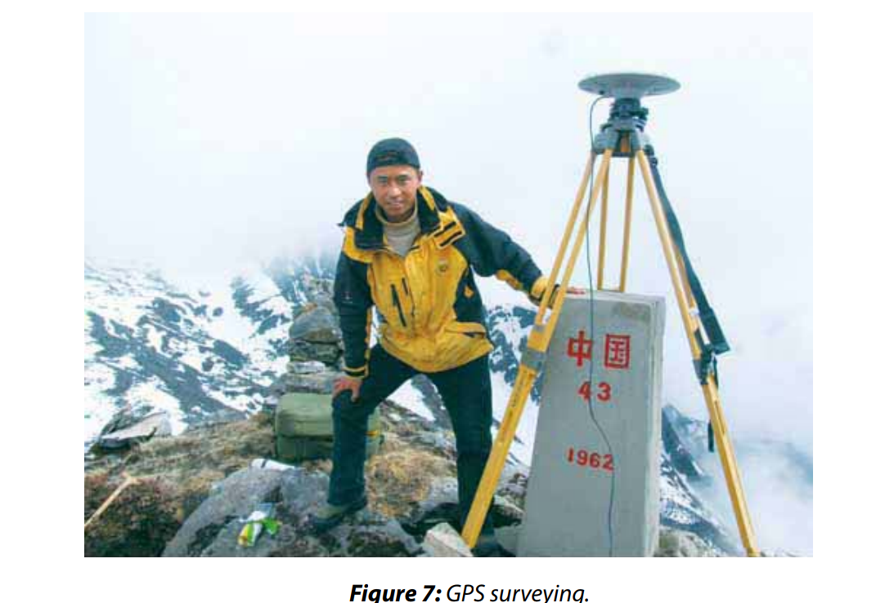

During the third inspection, all the pillars and markers were measured, and each one’s
location was accurately confirmed with the help of an advanced GPS technique. Exact
coordinates to the nearest centimeter of all border markers have thus been established.

Simultaneously, 57 sheets of border maps at a scale of 1:50,000 were prepared digitally by
using GIS. This technology has been adopted to facilitate the implementation of joint survey works. Digital data have been created at various layers of the GIS, such as the latitude,
longitude, and height of the markers, the contour terrains, water bodies, settlements, and
greenery. The total length of the measured Nepal–China boundary line is 1,439.18 km.

In accordance with a joint agreement, China is responsible for determining and mapping the boundary survey, whereas Nepal is responsible for the inspection and confirmation. Notably, the present joint inspection committee has been working since 2005. However, the work has not yet been completed in order to sign the Fourth
Boundary Protocol. If we look back at the work of previous Boundary Protocols, the
initial border demarcation work was completed within two and a half years, from
1961–62. Similarly, the first and second joint boundary inspections were completed
in two and one-year periods from 1977–1978 and 1988, respectively, and the protocol was duly signed.

However, the third joint committee has been working for more than seven years. All
technical works, including preparation of digital strip-maps have been completed. 57
sheets of border maps were prepared, using GPS technology.

But a few issues have not yet been resolved. The first one refers to the location of the
newly found boundary marker 57. The second refers to the so-called dual heights of
Mt. Everest. As far as the height of Everest is concerned, China proposed to report it as
8,844.47 meters, as the rock height, thus declaring a height decrease of 3.53 m. They
established the new height in May 2005, deducting the thickness of the ice on the top

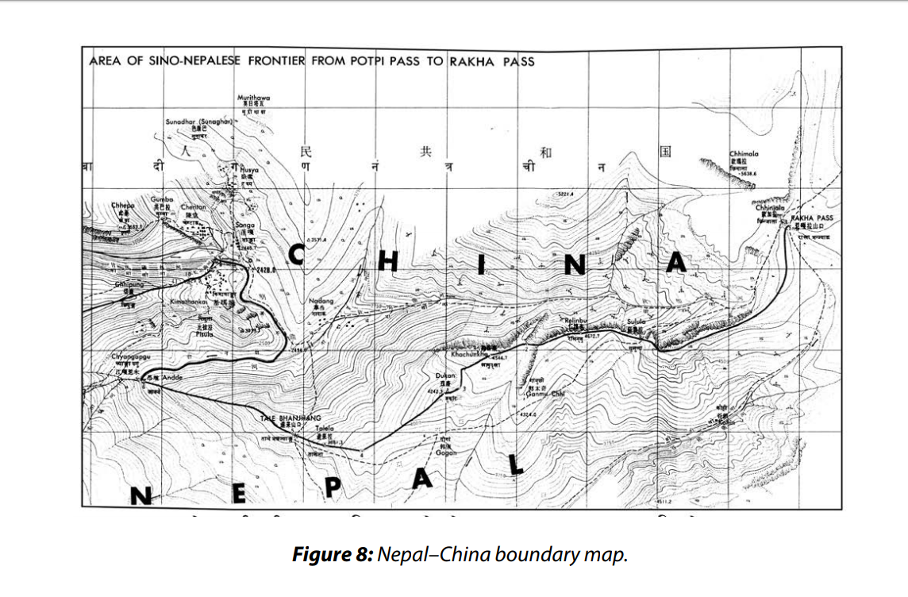

of Everest. Nepal is neither willing to accept the lowered height, nor the new height of
8,850 meters determined in 1999 by the US National Geographic Society.

During the joint discussions, China proposed to write on the map two heights of the
peak of the Everest: the Chinese height (8,844 m) without the thickness of ice, and the
traditional Nepali height (8,848 m) with the ice. Nepal hesitated in accepting the Chinese proposal. This is one of the reasons why the duration of the joint boundary committee has been prolonged.

The second reason is concerned with the locations of the recently found boundary
marker 57. It should be located on the tip of the snowy Himal at a height of 5,738 m.
However, it was found at a location slightly inside Nepal with reference to what was
previously presumed. The map, which was prepared during the previous inspections
without depicting marker 57, shows the borderline slightly north of this marker. If the
borderline runs through this marker, there may be a question of approximately six hectares of land located on the Nepali side, which is barren and steep, and which has no
use. According to the media, Nepal claimed that the marker was not established in an
appropriate place. The Chinese side countered that it was not moved from its original
position, and that it was at the same point where it was originally established during
the demarcation in 1962.

This may be one of the reasons leading to the incomplete status of the remaining issue
of the third joint inspection. However, the joint field survey team submitted its field
report, in which it mentioned the GPS coordinates to the Ministries of Foreign Affairs in
July 2009, in the respective countries.

Both agreed upon a five-day joint boundary committee meeting on February 1, 2012
in Xian, China to settle the outstanding issues. This committe was also expected to prepare the groundwork for the signing of the so-called Fourth Protocol of Nepal–China 
boundary maps. However, this meeting was cancelled by Nepal. The final agreement
regarding the remaining open issues between the two states and the signing of the
Fourth Protocol have been delayed; both sides are still waiting for an appropriate meeting. 

6.2 Nepal–India Boundary Documentation

The Joint Technical Committee (JTC) demarcated 97 percent of the total 1,880 km-long
Indo–Nepal border line within a period of 26 years –1,240 km as a land boundary and
640 km as a river boundary. There are 57 rivers, streams, rivulets, and brooks that act
as Border Rivers. The main rivers are Mahakali, Narayani, Mechi, Rapti, Ghongi Uriya,
Jamuni, Arrah, and others. 182 strip-maps were prepared at a scale of 1:15,000, covering half a kilometer on each side of the border line. The JTC delineated 8,853 boundary
pillars, including Junge masonry pillars, on the maps, 873 of which are main and 7,680
are subsidiary pillars. It is notable that 3,227 subsidiary pillars are yet to be constructed
on the ground. Half of these pillars under construction are in the river sectors. The numbering of the border pillars began from east to west, in a few segments.

182 strip-maps have been primarily signed jointly by the Surveyor General of India and
the Director General of the Survey Department of Nepal on December 19, 2007. India is exerting pressure on Nepal to sign these maps by the plenipotentiaries of both
countries. But Nepal is of the opinion that it would not suite international practice to
sign incomplete documents. Thus, the maps will be signed after the completion of all
boundary issues, since the maps will be the only attached document during the signing of the Boundary Protocol.

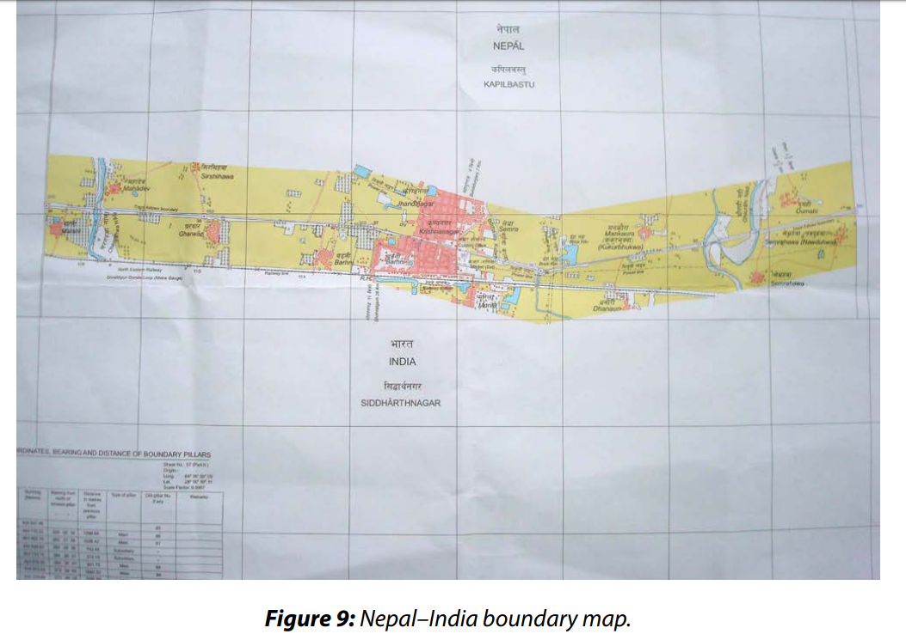
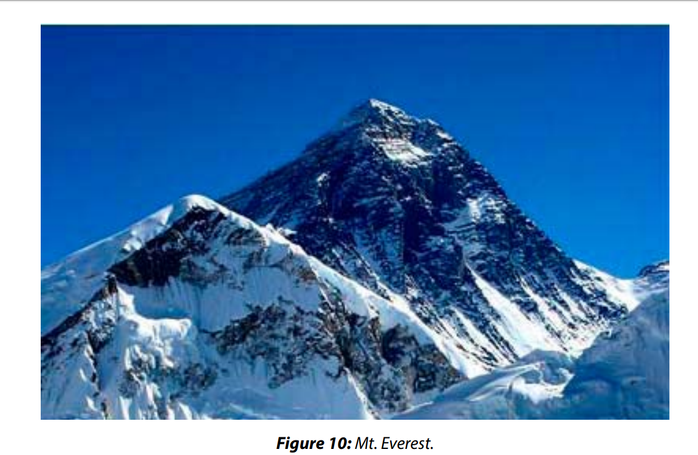

6.3 Examples of Interesting Special Cases

The case with China regarding its claims concerning Mt. Everest and the two cases of
Kalapani and Susta with India will be discussed next.

The Case of Mt. Everest

Nepal and China signed the Sino–Nepal Boundary Agreement in Beijing on March 21,
1960 to form a joint border committee to demarcate the border between Nepal and
China, to carry out a survey of the border, to erect border pillars, and to prepare a draft
for the border treaty. Returning to Kathmandu, the Prime Minister of Nepal had a press
conference on April 3, 1960 and disclosed, off the record, that Mt. Everest lies in the area
claimed by China. China argued that Everest belongs to China but Nepal rejected that
claim. The claim over Everest was considered something new during the Prime Minister’s visit to Beijing. Since Nepal rejected it outright, there were no further talks.15 But it
was not known how much area of Everest was claimed by China.

PM Koirala said that there could be talks regarding China’s claim over Mt. Everest during
the visit of Chinese PM Chou En-Lai to Kathmandu. He also hoped that the claim over
Mt. Everest and other border disputes could be resolved using the working procedure
of the border agreement.

China said that the Tibetan name of the peak as Chomolugma had been in use for a
long time. In reply, Nepal said that the Nepali name is Sagarmatha. According to the
Chinese, that name was recently coined. During the talks in Beijing the two parties just
exchanged maps. The Chinese maps, which were drawn on the basis of Chinese history, show the mountain within Chinese territory, whereas the Nepalese maps, which
were drawn on the basis of Nepalese history, show the mountain on the boundary line 

> 15 Risal, Bhairab, Patrika Weekly, September 2–8, 1999, p. 8.

between the two countries. At that time, PM Koirala made the point that Nepal had
always regarded this mountain as its own. Chairman Mao Tse-tung, when he received
PM Koirala, expressed the view that they could follow the Nepalese delineation, which
shows the mountain on the boundary line, with the northern half of the mountain belonging to China and the southern half of the mountain belonging to Nepal. Following Chairman Mao Tse-tung’s talks with PM Koirala, the government of Nepal has long
maintained this attitude.

Before his visit to China, PM Koirala consulted with the noted historian Baburam Acharya. Acharya told him that his studies a long time ago had found that the Nepali name
for Everest was ‘Sagarmatha’ and that it was recognized at the governmental level in
1956. Although Acharya had named the peak Sagarmatha in 1938, Nepal could not
make this point to the Chinese because the name was formally recognized nearly three
decades ago.

According to Baburam Acharya’s research and investigation, Sagarmatha was formed
by the combination of two words Sagar and Matha. He had maintained that the word
Sagar is the transformation of swarga (heaven) in Vedic and Sanskrit letters, and that
it is in use in Nepali language. For instance, the Nepalese people say “Sagar Dadhyo”
when the western horizon appears to glow at sun-set time and it is always remembered
by local inhabitants. Similarly, Math or Matha signifies the sky or the head, the tallest
part of the body. In summary, Sagar denotes the heaven or sky and Matha is the head or
crest. In this way, Sagarmatha means ‘the head reaching up to the sky.’ Thus, it becomes
pertinent and meaningful to call the peak as Sagarmatha in Nepali language, since it is
the highest mountain in the world.

*Friendship Peak*

China might have claimed Mt. Everest because Nepal failed to present a map, made by
Nepal, satisfactory to China, and its original Nepalese name for the peak in a convincing
manner. Still, Nepal kept on saying in a meek tone that Sagarmatha belongs to Nepal.
This was also the reason that Chairman Mao Tse-tung accepted that Chomolungma
and Sagarmatha were the same peak and agreed to the borderline according to the
map presented by Nepal. He had also suggested to abandon the different names used
in the two countries and outside such as Sagarmatha / Chomolungma / Mount Everest;
and rather, to call the peak ‘Friendship Peak’ as a symbol of friendship between Nepal
and China.

In the meantime, the Chinese PM Chou En-Lai paid a three-day-visit to Nepal to
strengthen Nepal–China relations and to resolve the issue of Everest. In this connection the Chinese prime minister said at a press conference on April 28, 1960 that ‘Mount
Everest belongs to Nepal’; thus, the Everest issue was resolved at once.18

In a reply to a correspondent who asked why China had given up regarding its claim
over Everest, PM Chou En-Lai said that PM Koirala had provided maps and supporting
documents to China supporting the claim. China studied and examined the maps at
political, technical, administrative, and diplomatic levels; and the government of China
reached a conclusion that those maps are genuine. Therefore, he said that Everest belongs to Nepal.

> 16 Bhasin, Avtar Singh (1994), Nepal’s Relation with India and China Documents 1947–1992 Vol–II: 1264.
> 17 Acharya, Baburam (2003), China Tibet and Nepal (in vernacular), Kathmandu, p. 250.
> 18 Risal, Bhairab, Patrika Weekly, September 9–15, 1999, p. 8.

Accordingly, the northern face of Everest belonged to China and the southern face to
Nepal. The highest portion with the terracing slope is on the side of Nepal. Any climber
reaching the peak cannot stand on the steep slope on the Chinese side, but rather on
the sloping terraced portion of the peak, which is on the Nepalese side. So Mt. Everest
is considered to be in Nepal.

The Chinese Prime Minister also informed the press that the Nepalese Prime Minister
had told them that historically anyone who climbed Mt. Jolmo Lungma/Sagarmatha
from the south had to secure a visa from Nepal, whereas anyone who climbed the
mountain from the north had to obtain a visa from the Chinese Government. He said
that the Chinese had agreed to these terms.

*The peak of Mount Everest*

From the peak of Mt. Everest the slopes go down towards three different directions.
One slope declines to the west; a second slope declines towards the northeast; and
a third slope declines towards the south. The western ridge is long and steeply slanted. The northeastern slope appears to be very steep as a cliff, and the southern slope,
which is less steep, bears a considerably gentler decline and is a little more comfortable
than are the other two. The western and southern ridges act as the international borderline between Nepal and China. The northeastern slope lies completely on the Chinese side. The northern face of the ridge is more dangerously steep than the western
and southern ones. In comparison with the others, the southern side located towards
Nepal is less steep for climbing.

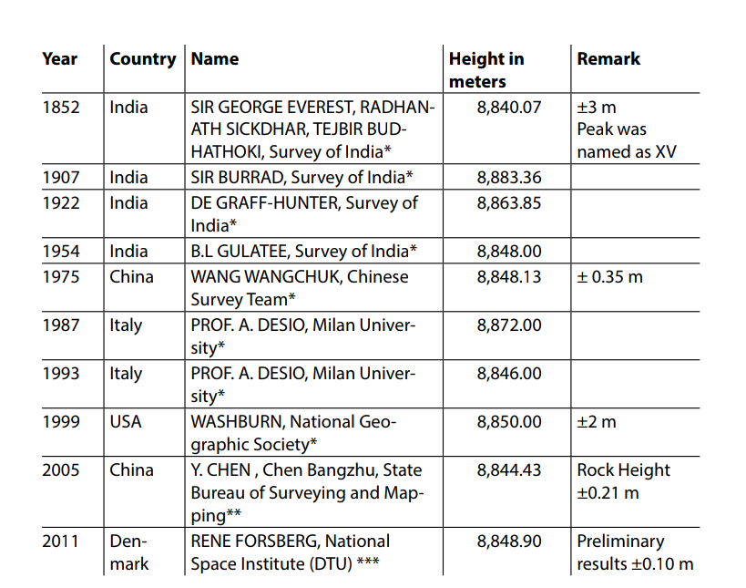

* www.nepalhomepage.com/himalaya/sagarmatha.html
** www.explorersweb.com/everest_k2/news.php?id=821
*** www.thehimalayantimes.com/fullTodays.php?…Everest+going…grea.

An important issue about the peak of Everest regarding climbers is that there is a 2 m
by 2.3 m sloping terraced area, on the southern side of the demarcating line that follows the water-parting ridge. That piece of sloping terraced area lies on the Nepalese
side. The Chinese side of the borderline is almost vertical. Anyone conquering Mt. Everest from the northern Chinese side cannot set foot on the peak without stepping on
that sloping terraced area on the Nepalese frontier, and no one can remain standing
on the water-parting ridge of the borderline. This sloping terraced area of the world’s
highest summit, which is located on the Nepalese side of the borderline, links the summit with Nepal. That sloping terrace with the highest peak cannot accommodate more
than seven or eight people at a time.

Various surveying organizations have challenged the nominal height of Everest. The
known height used to be 8848 m. On October 15, 2005, however, the Chinese State
Bureau of Surveying and Mapping declared that ‘The elevation of Mt. Everest’s summit
is 8844.43 m.

Preliminary results of a survey being jointly undertaken by the National Space Institute
(DTU) of Denmark and the Department of Survey (DoS) of Nepal obtained a height of
8,848.9 m in the World Height System, 90 cm higher than the current official value of
Nepal. The margin of error is about 10 cm. In connection to height determination, the
geoid of Nepal was measured through an airborne gravity survey in December 2010.
The Himalayas are the most rugged gravity field on the planet, and one of the goals of
the 2010 AD 35,000 feet high airborne survey was to determine a revised height of Mt.
Everest. Scientists think Everest is growing higher by about 4 mm every year due to an
uplift caused by the Indian tectonic plate pushing northward.

Regarding the history of measurement of the height of the Everest, the followings are
the different measurements made by various institutions:

Case Study of the Kalapani-Limpiyadhura Issue

Kalapani-Limpiyadhura is located at the northwestern corner of Nepal, where the frontiers of Nepal, India, and China meet. This area is situated in the eastern part of the Kali
River, as drawn on the historical maps published before 1860. According to the Treaty
of Sugauli, the Kali River is the western boundary of Nepal with India. The boundary of
the Kali river is delimitated by Article 5 of the treaty. It states “the Rajas of Nepal renounces for himself, his heirs, and successors, all claim to or connection with the countries lying
to the west of the river Kali and engages never to have any concern with those countries or
the inhabitants thereof.” Hence, the origin of the Kali River should be the northwestern
border corner of Nepal with India and China as a tri-point.

The river is known as Kali at the upper reaches, Mahakali in the middle portion, and
Sarjoo or Sharda or Gogra or the western branch of Gogra where it comes down to
the plain area. The origin of the Kali River has not yet been demarcated. There is a controversy and much debate regarding determining the point of origin of the Kali River,
whether it originated from Limpiyadhura (5,532 m), Lipulek (5,098 m), or an artificial
pond (4,571 m). The second debate is with regard to the location of Kalapani, whether
it is located in Nepal or India. This is an issue of national interest, and has raised much
outcry in Nepal since October 1996.

Regarding the determination of the origin of the Kali River, there are three different
opinions: One opinion, of scholars in Nepal and which is based on historical documents, 

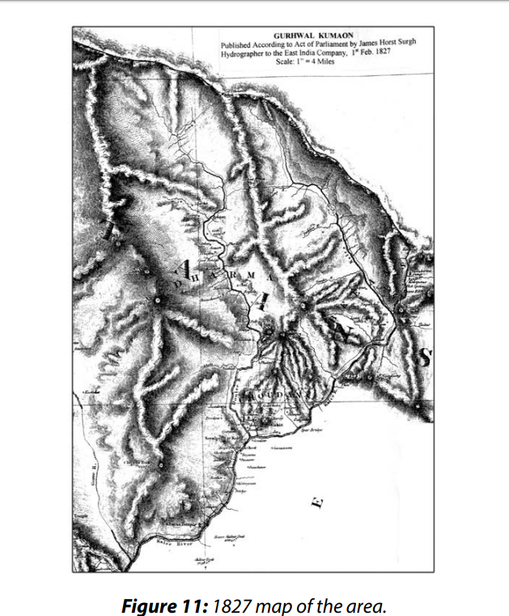

old maps, and hydrological facts, considers Limpiyadhura as the origin of the Kali River
in the Treaty of Sugauli. A second opinion, of the Government of Nepal, considers the
nearby Lipulek pass as the origin of the Kali River. The third, of the Indian team of the
Nepal–India Technical Level Joint Boundary Working Group, considers the origin of the
Kali River at a small pond, near the temple of Kali, which is located south of Kalapani
and further south of the Pankhagad stream.

A description of the origin of the river is not mentioned in the treaty. It was not necessary to make a description of the river at that time, because there was no controversy
and there was only one river that was known as Kali. In order to come to a certain conclusion, one has to study the historical documents and old maps from the time of the
treaty, and to study the hydrological facts.

On the historical maps of 1827, 1850, 1856, and on other maps, the river, the origin of
which is at Limpiyadhura is called the Kalee; it was delimited by the Treaty of Sugauli,
as the western borderline of Nepal.

Kalapani itself is located east of the Kali River, an area which, according to the Treaty of
Sugauli, is considered territory of Nepal.

As far as maps as evidence are concerned, there are many pre-1860 maps, depicting the
origin of the Kali River at Limpiyadhura 16 km northwest of Kalapani. These 1860–1880
maps maintain the geographical position of the Kali River and the location of Kalapani,
but the name Kali was changed to Kuti and then to the Kuti Yangti River. On post-1880  maps the name of the river, which originated from Limpiyadhura, was changed to Kuti
Yangti and a river flowing from the nearby Lipulek Pass was called the Kali River, causing Nepal a loss of almost 310 square km of land, west of the Lipu River.

A 1879 map of the Survey of India shows the borderline further east of this area and
toward the river, and shows the northern origin of the border at an artificially formed
pond, then, along one and a half km along a rivulet. This cartographic presentation
shows Kalapani on the Indian side, making Nepal lose an additional 62 square kilometers of territory.

Since 1962 India has maintained armed forces at Kapalani. During the war with China,
the Indian Army built permanent structures with bunkers in the area of Kalapani, east
of the Kali River. On June 9, 1998 the PM of Nepal claimed that Kalapani is within the
territory of Nepal as depicted on the maps of 1850 and 1856, published by the Survey
of India. He said that the dispute needs to be resolved by carrying out a comprehensive
study of all historical documents and proofs.

The issue of Kalapani was mentioned during visits of senior Indian officials to Kathmandu (the Indian PM in June 1997 and the Indian Minister of External Affairs in September 1999) who forwarded the issue to the joint boundary working group. But the issue has
not been resolved at the technical level in spite of the instructions.

The Kalapani issue was raised during the meeting of the Nepal–India Boundary Joint
Working Group on July 17, 1998. Nepal proposed to take the maps of 1827, 1850, and
1856 as the working materials to be used by the joint survey teams. The Indian side
rejected these maps as irrelevant and unscientific. Instead, they claimed that the maps
prepared during 1879 and 1928/29 must be taken as the basic working materials to the
field. In countering this claim, Nepal stated that those maps are baseless. The meeting
ended with no decision. The issue of Kalapani-Limpiyadhura should be resolved amicably on the basis of maps from the treaty of the Sugauli era.

Case Study of the Susta Border Dispute

Another interesting case is Susta, which is situated to the east of the Narayani River in
the mid-southern part of the Nawalparasi district in the area left over by the flood. On
its west side flows the Narayani River, and it is surrounded by India on the north, east,
and south by a curved boundary line. Owing to encroachment of a major portion of
Susta VDC, the remaining area was merged with Tribeni VDC in 1980. Now it is called
ward number 4 of Tribeni VDC.

The Susta area came within the Nepali territory when the British returned the Tarai region, from the Koshi River to the Rapti River, on December 11, 1816 instead of paying
two hundred thousand Rs. annually, as per Article 4 of the Treaty of Sugauli. The demarcation of border pillars along the Susta borderline began in 1829, and in 1883–84–85
the border map was also prepared. The map shows the borderline being delineated
from Tribenighat to Susta along the mid-current of the Narayani River. Where the borderline passes along the river to the south of Susta, the borderline leaves the river sector and turns west to catch the land boundary. Boundary pillars were constructed towards the west, bending from the Sagardinhi village. As a result, Junge masonry pillar
number 1 was constructed at Sagardinhi and pillar number 2 was in Mangalbari. But
no pillar was constructed along the river course. Since 1885, there has been a dispute
between the two countries over a length of 24 km along the Gandaki River, from Tribeni 

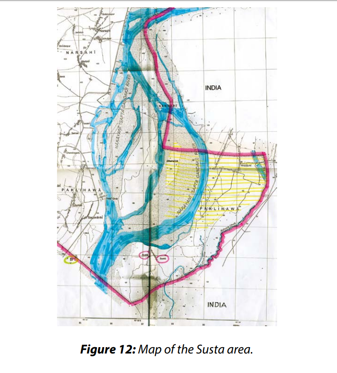

to Sagardinha, where the three places (Gorakhpur of Uttarpradesh, Champaran of Bihar
of India, and Nawalparasi of Nepal) meet together.

*The reason for the dispute*

The change of course of the river is the main reason for the dispute in the Susta area.
Other reasons are floods, cutting and clearing of jungles, and bad roads. The Narayani
River – called Gandak in India – has been changing its course from east to west for
hundreds of years. Every time the Narayani River, which separates India on the east and
Nepal on the west, cuts its banks on the west, additional Nepalese territory gradually
shifts into India.

Owing to a few big floods during the last two centuries, thousands of hectars of land,
approximately 14,500 in total, have been encroached upon by the river floods from Nepal’s territory. This complicated situation was also followed by criminal incidents that
inflamed the dispute between the two countries. The Susta area is very fertile because
of the alluvial soil brought by the river. In addition, there was a dense forest. The Indians
came over to Susta to chop down the trees. They illegally transported the timber and
wood to India. Later, they settled in the area because of the fertile land and the easy access from India. In time the number of Indian farmers and timber smugglers increased,
outnumbering the Nepalese who had lived there for ages. There were 162 Nepali families in Susta until a few years ago. But the number of Indian families who settled there
was more than 200. Since the area lies east of the river, the Indian population in that
area claims that the area belongs to India. Indian nationalists have claimed the western
flow of the Narayani River as the borderline. They have also drawn maps at the local
level, accordingly. In such a map a portion of the Narashahi village is shown within Indian territory. Nepal, while preparing its map, has taken the river course of 1817 as the
borderline. The topographical maps of that area prepared in 1992–93 show the course
of the river as of 1817 as the borderline.

The shifting of the river course. Whenever the Narayani River finds a new course, cutting
Nepal’s territory on the west, India adopts the new course of the river as the boundary
and claims the land left behind by the river as its own, and thus, it encroaches upon
Nepal’s territory. Nepal’s stance is that the change in the course of the river should not
be linked with the boundary line, and that the borderline should be maintained at the
place where the river used to flow at the time of the treaty between Nepal and the British Government. India’s position is that the borderline follows the changes of the river.
This is the crux behind the dispute at Susta.

All attempts to solve the problem either by local officials or at the central government
level have failed. Such an attempt failed even in 1972, when the relations between the
two countries were warm.

The main cause of the conflict lies in the shifting of the course of the river. The second
reason is that when the demarcation was made by the British Surveyors in this area, no
pillar was erected on either side of the river. In addition, no border pillars were erected
on the banks of the river during the boundary surveys of 1817, 1829, and 1883–85, and
also not during the topographical survey of the Survey of India in 1922. This left room
for the disputes along the river areas.

The problem is awaiting a solution. A joint Border Commission was formed in 1929.
Meetings of representatives of the governments of Nepal and Bihar were held in 1937,
1947, 1952, and 1953 to settle the dispute. An additional dialogue between the two
governments was held on April 27, 196319, and later on. The Susta issue has been discussed in several meetings of the Nepal–India Joint Technical Boundary Committee,
including the last one in December 2007. But there were no successful results and the
dispute still awaits a solution. 

7 LESSONS LEARNED

During the demarcation, although China had initially claimed Mt. Everest, it later recognized Mt. Everest as being in Nepal on the basis of a map and documents presented by
Nepal. The process was conducted with deep friendship and cordiality between the two
countries. The whole process of demarcation proceeded smoothly, based on the traditional principle of watershed and on the basis of mutual benefits, peace, and friendship.
All issues related to border demarcation were solved to the satisfaction of both sides.

Note that the issue of Mt. Everest was resolved at the level of the prime ministers. There
is no certainty that this issue would have been resolved so amicably if it was taken up
at a lower level. A lower level does not have the authority to make such decisions and
in such a case the issue could have remained unsettled. If a convoluted issue becomes
a matter of prestige at the national and international level, it may get out of proportion
and remain disputed.

The treaty of Sugauli between Nepal and British India failed to delimit clearly the Nepal–India borderline in many segments, thus leaving room for problems until today. 

> 19 Shrestha, Hiranya Lal (1998) Indo–Nepal Relations, p. 57.

There were problems in demarcating the boundary line and in erecting border pillars
at several places. The area of such disputed places is estimated to be around 60,650
hectares. In many of these areas, there are still claims, counter-claims, discussions, controversies and arguments from both sides.

There are still accusations regarding encroachment and disputes at 70 places along
the Nepal–India borderline. The prominent areas have been identified as KalapaniLimpiyadhura, Susta, Mechi area, Tanakpur, Sandakpur, Pashupatinagar, Hile Thori, and
others. It is important that the boundary treaty and the delimitation should be detailed
and clear as much as possible to mitigate boundary conflicts.

8 CONCLUSIONS AND RECOMMENDATIONS

The Height of Mount Everest

The third joint boundary inspection to sign the fourth boundary protocol between Nepal and China should be completed as soon as possible. The connection of the recently
found boundary marker 57 to the borderline must be based on the boundary delineation and facts on the ground.

Technical skills must be used, and the issue should not be influenced by sentiments,
simply because border demarcation and inspection is purely a technical job. To find
a proper solution, both countries should act according to the spirit of the treaty and
previous boundary protocols and maps. These issues should be resolved by higher authorities through diplomatic channels, since they have already been forwarded from
the technical level. From the perspective of good relations, friendship, and mutual understanding between Nepal and China in all spheres, this type of minor border issue
should be resolved in an amicable manner. The Fourth Boundary Protocol should be
signed as soon as possible, sorting out the debatable items in due course.

Nepal and China should measure and determine jointly the precise height of the tallest
mountain in the world. The height controversy should be settled once and for all.

Establishment of Nepal–India–China Tri-Junction Points

The total length of the Nepal–China boundary line demarcated so far is 1,439.18 km.
The main boundary pillars erected along the boundary line are numbered 1 to 79 in
serial order from west to east, with many reference pillars on both sides of the borderline. However, the tri-junction points on both the western and eastern ends of the
borderline, where the Nepalese, Chinese, and Indian territories meet, have not yet been
fixed. This is because an Indian representative was not present during the Nepal–China
boundary demarcation. Nowadays, India and China have improved their relations. India–Nepal neighborly relations have been maintained for centuries. Nepal must formalize all its border issues through diplomatic channels, including the establishment
of Nepal–India–China tri-junction points.

The western tri-junction point should be determined according to the maps and documents published by the Survey of India around the time of the treaty of Sugauli. Nepal
has to convince its southern neighbor, India, and to invite its northern neighbor, China,
to decide on a single platform for the finalization of the triple point, since this point is
related to all three countries, and their joint presence is required.

### REFERENCES
- Acharya, Baburam (2003), China Tibet and Nepal (in vernacular), Kathmandu.
- Aitchison, C.U. (1929), A Collection of Treaties Vol. VIV, Calcutta, India.
- Bhasin, Avtar Singh, (1994), Nepal’s Relations with India and China, Siba Exim India.
- Devkota, Grishma Bahadur (1983), Political Mirror of Nepal (in vernacular), Vol. III, Kathmandu.
- Himali, Chetendra Jung (2002), Cross Sides of Mahakali (in vernacular), Kathmandu.
- Indian Aggression on Nepal (1994), Informal Sector Service Center, Kathmandu.
- Nepali, Chitta Ranjan (1964), Nepal–China Boundary (in vernacular), Kathmandu.
- Pant, Shastra Dutta (2006), Nepal–India Border Problems, Kathmandu.
- Singh, Amar K.J. (1988), Himalayan Triangle, The British Library, London.
- Shrestha, Buddhi Narayan (2004), Boundary of Nepal ((in vernacular), Kathmandu.
- Shrestha, Buddhi Narayan (2003), Border Management of Nepal, Kathmandu.
- Shrestha, Hiranya Lal (1998), Indo–Nepal Relations, Kathmandu.
- Study Tour Report on Nepal–India Border Issues, (Vol. I–IV, April–May–July–August 2010), Constitution Assembly, IRHR Committee, Kathmandu.
